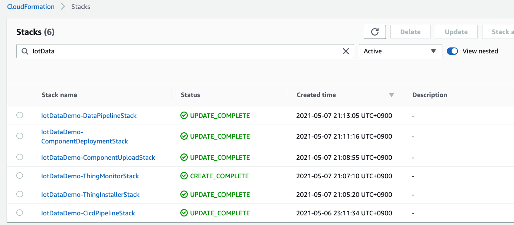
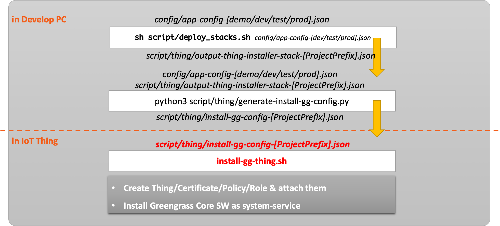
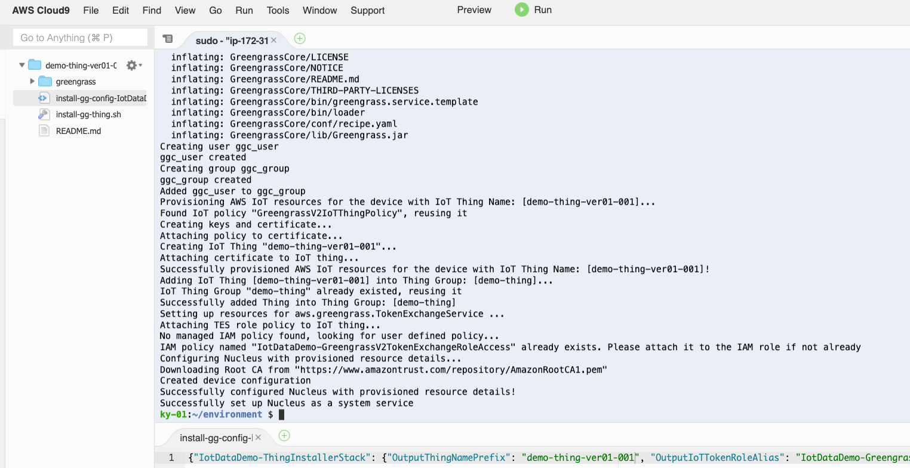
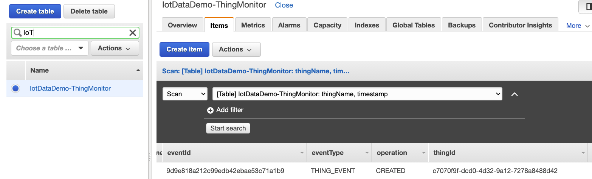
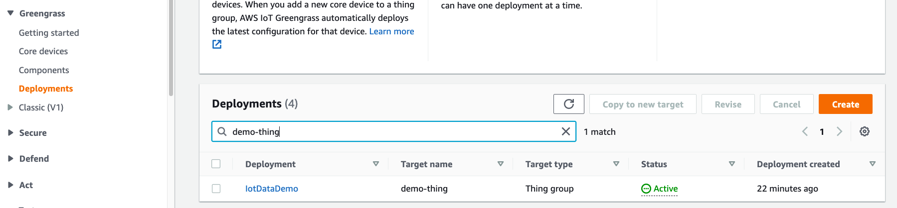
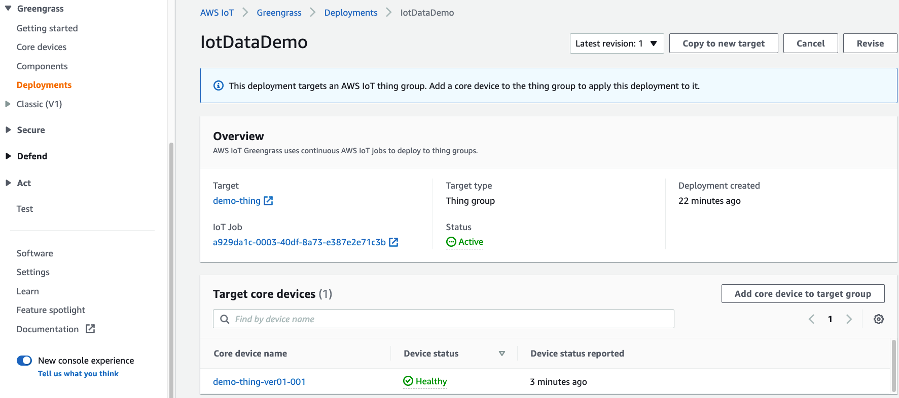
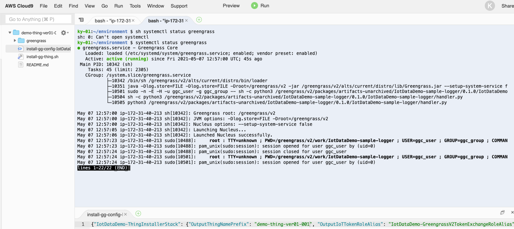
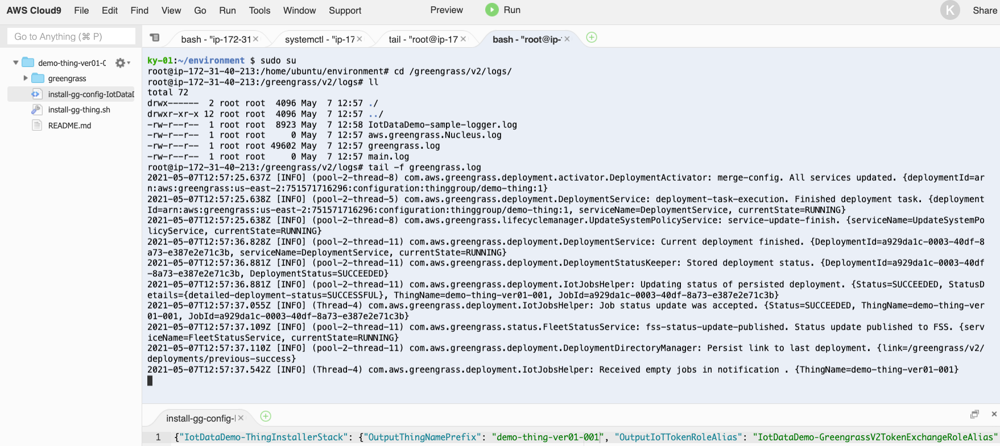
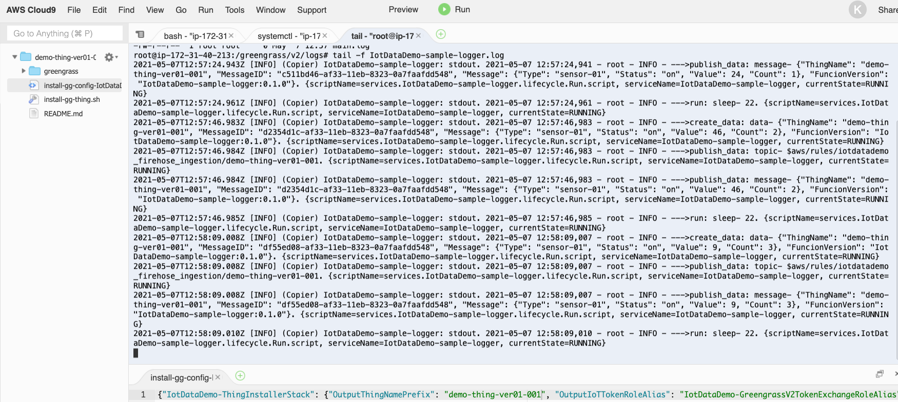

# Matter Cloud Controller (Python)

The Matter Cloud Controller is a python based tool that allows you to commission a Matter device (via the cloud) into the network and to communicate with it using the Zigbee Cluster Library (ZCL) messages.

# Control Device Setup

1. On raspberry pi 4 (4GB). Download Ubuntu Server 21.10 using RPI imager on a 64 GB micro SD card. Note 21.04 is no longer available.

2. Follow build instructions "Building Matter" from GitHub.com/NRFConnect/sdk-connectedhomeip
Note: ensure that the versions are aligned between nrf app and chip controller
e.g. if nrf version is v1.9.0 then git checkout v1.9.0 of sdk-connectedhomeip

2.1 In order to speed up the compilation and reduce risk of pi hanging you might consider adding 4GB as swap as per https://www.linuxtut.com/en/71e3874cb83ed12ec405/

3. Ensure router advertising is enabled on raspberry pi controller
```
sudo sysctl -w net.ipv6.conf.wlan0.accept_ra=2
sudo sysctl -w net.ipv6.conf.wlan0.accept_ra_rt_info_max_plen=64
```
4. If having difficulties try these steps:

Remove temp files
```
sudo rm -rf /tmp/chip*
```

Clear out MDNS cache on OTBR
```
sudo systemctl restart mdns.service 
```

Clear out avahi MDNS cache on Raspberry Pi
```
sudo systemctl restart avahi-daemon.socket 
```

# The stack provisioning is loosely based on "AWS IoT Greengrass OnBoarding and Data Logging using AWS CDK" https://github.com/aws-samples/aws-iot-greengrass-v2-using-aws-cdk

## Solution Architecture

- Thing Installer: provide Greengrass ver2 Installer with a customized IAM Role(output-thing-installer-stack-MCCDev.json)
- Component Upload/Deployments: deploy component's logic(sampl)


<<<<<<< HEAD
=======

## CDK-Project Build & Deploy

To efficiently define and provision aws cloud resources, [AWS Cloud Development Kit(CDK)](https://aws.amazon.com/cdk) which is an open source software development framework to define your cloud application resources using familiar programming languages is utilized.


Because this solusion is implemented in CDK, we can deploy these cloud resources using CDK CLI. Among the various languages supported, this solution used typescript. Because the types of **typescript** are very strict, with the help of auto-completion, typescrip offers a very nice combination with AWS CDK.

***Caution***: This solution contains not-free tier AWS services. So be careful about the possible costs.

### **Prerequisites**

First of all, AWS Account and IAM User is required. And then the following modules must be installed.

- AWS CLI: aws configure --profile [profile name]
- Node.js: node --version
- AWS CDK: cdk --version
- [jq](https://stedolan.github.io/jq/): jq --version
- boto3

```bash
pip install -r ./requirements_dev.txt
```

if not installed you can use the command:

Please refer to the kind guide in [CDK Workshop](https://cdkworkshop.com/15-prerequisites.html).

### ***Configure AWS Credential***

```bash
aws configure --profile [your-profile] 
AWS Access Key ID [None]: xxxxxx
AWS Secret Access Key [None]:yyyyyyyyyyyyyyyyyyyyyyyyyyyyyy
Default region name [None]: eu-west-1 
Default output format [None]: json
    
aws sts get-caller-identity --profile [your-profile]
...
...
{
    "UserId": ".............",
    "Account": "75157*******",
    "Arn": "arn:aws:iam::75157*******:user/[your IAM User ID]"
}
```

### ***Check cdk project's default launch config***

The `cdk.json` file tells CDK Toolkit how to execute your app.

### ***Set up deploy config***

The `config/app-config.json` files tell how to configure deploy condition & stack condition. First of all, change project configurations(Account, Profile are essential) in ```config/app-config.json```.

```json
{
    "Project": {
        "Name": "MCC",
        "Stage": "Dev",
        "Account": "75157*******",
        "Region": "eu-west-1",
        "Profile": "ggcuser"
    },
    ...
    ...
}
```

And then set the path of the configuration file through an environment variable.
Note: You must be in the aws-cdk directory. You only need to run this script when setting up the environment

```bash
export APP_CONFIG=config/app-config.json
```

### ***Install dependecies & Bootstrap***

```bash
sh ./scripts/setup_initial.sh config/app-config.json
```

### ***Pack IoT Greengrass components***

```bash
sh ./scripts/pack_components.sh config/app-config.json
```

Check whether ***zip*** directory and file are created in ***src/component/sample***.

### ***Deploy stacks(1st provisioning)***

Before deployment, check whether all configurations are ready. Please execute the following command.

```bash
cdk list
...
...
==> CDK App-Config File is config/app-config.json, which is from Environment-Variable.
==> Repository Selection:  CodeCommit
MatterControllerDev-ComponentDeploymentStack
MatterControllerDev-ComponentUploadStack
MatterControllerDev-MccInstallerStack

```

Check if you can see the list of stacks as shown above.

If there is no problem, finally run the following command.

```bash
sh ./scripts/deploy_stacks.sh config/app-config.json
```

You can check the deployment results as shown in the following picture.



### ***Destroy stacks***

Execute the following command, which will destroy all resources except S3 Buckets. So destroy these resources in AWS web console manually.

```bash
sh ./scripts/destroy_stacks.sh config/app-config.json
```

### ***CDK Useful commands***

* `npm install`     install dependencies
* `cdk list`        list up stacks
* `cdk deploy`      deploy this stack to your default AWS account/region
* `cdk diff`        compare deployed stack with current state
* `cdk synth`       emits the synthesized CloudFormation template

## How to install thing

### Generate `install-gg-config-[ProjectPrefix].json`

Please prepare `install-gg-config-[ProjectPrefix]`.json file, where ***[ProjectPrefix]*** is "Project Name" + "Project Stage" in ***app-config.json***. For example, ***MCCDev*** is [ProjectPrefix] in this default ***app-config.json***.

```bash
sh ./scripts/deploy_stacks.sh config/app-config.json # generated-> ./scripts/thing/output-thing-installer-stack-[ProjectPrefix].json
python3 ./scripts/thing/generate-install-gg-config.py -a config/app-config.json -t ./scripts/thing/output-thing-installer-stack-[ProjectPrefix].json # generated-> ./scripts/thing/install-gg-config-[ProjectPrefix].json

#Do this the first time when run to update the iot policy to allow iot shadow interactions
python3 ./scripts/thing/update_iot_policy.py -a config/app-config.json -p '{"Version": "2012-10-17","Statement": [{"Effect": "Allow","Action": ["iot:GetThingShadow","iot:UpdateThingShadow","iot:DeleteThingShadow","iot:Connect","iot:Publish","iot:Subscribe","iot:Receive","greengrass:*"],"Resource": "*"}]}' 

```



Check whether ***install-gg-config-[ProjectPrefix].json*** is created in ***./scripts/thing*** directory.

### Transfer a config file into target device and execute a script in target devices

* ```./scripts/thing/install-gg-config-[ProjectPrefix].json```
* ```./scripts/thing/install-gg-thing.sh```

### Install Greengrass

1. Update a unique thing name in ***install-gg-config-[ProjectPrefix].json***

```bash
{
    "MCCDev-ThingInstallerStack": {
        "OutputThingNamePrefix": "demo-thing-ver01-001", <--- append a extra & unique suffix thing name !!
        "OutputIoTTokenRoleAlias": "MCCDev-GreengrassV2TokenExchangeRoleAlias",
        "OutputInstallerTempRoleARN": "arn:aws:iam::75157*******:role/MCCDev-InstallerTempRole",
        "OutputThingGroupName": "demo-thing",
        "OutputIoTTokenRole": "MCCDev-GreengrassV2TokenExchangeRole",
        "OutputProjectRegion": "eu-west-1",
        "OutputProjectPrefix": "MCCDev"
    },
    "Credentials": {
        "AccessKeyId": "******************",
        "SecretAccessKey": "88888888888888888888888888888888",
        "SessionToken": "FwoGZXIvYXdzELn//////////wEaDDiSD0li77wnn+e1NiK/Ae7CoclJAt4dV0diah/AjCwUUeRf44dtGVWFw7ZQDkBj732rFTcc5/FLL3+GcEDlAw4VUso5tG6dI/JVwzWBWnKDk9UWF4QBnCVYxSp9Jpcup06eJ44NYhuMMA8KTSY+Ea9Kf2JAVvG4hVKGEteJwU+lC5tUkuhcLtKaAuTdxefc6jyH9qfmIJcUfjpeDNm9+3OHOhsQrTWE+4a4VYgTP5PR7w7ouWNktlE5X/1z3L+sQ7D8rmtcZdgLef4h3+E2KMOQ0IQGMi2UR6B/e4Pj4ybeLdXk62+p3alCLzPNWo/Nh2N9nbak9FTb2TRk70WiFGT5jJ0=",
        "Expiration": "2021-05-06 16:16:19+00:00"
    },
    "ProjectPrefix": "MCCDev"
}
```

2. Install a Open JDK (headless Java JDK) on raspberry pi and confirm the installation
```
sudo apt install default-jdk-headless
java -version
```

3. Run the following commands

First, if not already done so, create some directories, the python virtual env

```
mkdir -p /home/ubuntu/mattercloudcontroller/scripts/thing
cd /home/ubuntu/mattercloudcontroller/scripts/thing
wget https://raw.githubusercontent.com/oidebrett/mattercloudcontroller/main/scripts/thing/install-gg-thing.sh .
```

then activate the python virtual env
```bash
source /home/ubuntu/connectedhomeip/out/python_env/bin/activate

```

4. Copy over the config details from your installation PC and store the contents in a new file install-gg-config-[ProjectPrefix].json


4. Then Run the following commands

```bash
sh ./install-gg-thing.sh install-gg-config-[ProjectPrefix].json
```

5. Make sure your main user account is add to the ggc_group:

```bash
sudo usermod -a -G ggc_group ubuntu
```

and that the ubuntu directory has grouped permissions set

```bash
sudo chown -R ubuntu:ggc_group /home/ubuntu/
```

```bash
sudo systemctl restart greengrass
```

Result of install-script


Result of Greengrass-installation


Result of Greengrass-deployment



### Check greengrass system-service

```bash
sudo systemctl status greengrass
```

Result of Greengrass-service


### Check greengass log

```bash
sudo tail -f /greengrass/v2/logs/greengrass.log
sudo tail -f /greengrass/v2/logs/MCCDev-mcc-daemon.log
```

Result of Greengrass-log



Note that when code changes are made, be sure to increase component's version in ```config/app-config.json``` and then re-create the zip file in ```src/component/sample/zip``` using the following command.

```bash
sh ./script/pack_components.sh config/app-config.json
```

After updating your logic, just git push the changes! And then CICD pipeline will automatically deploy that through Github Action & Greengrass deployments.

Or you can directly deploy those in local-dev PC using AWS CDK CLI like this.

```bash
sh ./script/deploy_stacks.sh config/app-config-demo.json
```

## Building and installing the local python matter controller

Before you can use the Matter cloud controller, you must install the connected home over ip library

To build and run the Matter Cloud controller:

1. Build and install the Python CHIP repl tool :

    ```
    [Follow the instructions for CHIP Repl Tool](https://github.com/project-chip/connectedhomeip/blob/interop_testing_te9/docs/guides/python_chip_controller_building.md#building)
    ```

<hr>

  
## Testing using the API

1. Find the IOT Endpoint using

    ```
    aws iot describe-endpoint --endpoint-type iot:Data-ATS
    ```

2. Execute API call using CURL

    ```
    curl -XPOST https://XXXXX.execute-api.eu-west-1.amazonaws.com/prod/message/chip-tool/request -H "x-api-key: XXXXX" -H "Content-Type: application/json" -d '{"txid": "123","command":"help"}'
    ```

3. Testing in Postman - Install Postman and import the Curl command above. You will need to set up Postman to generate AWS signature in the Curl requests. You can following this guide: https://blog.knoldus.com/how-to-generate-aws-signature-with-postman/
Note: the APIGateway URL and API key can be parameterised and made as a variable.


## Testing during developement

navigate to the directory above the matter controller

Avahi keeps a cache of old results. To reset the cache, kill the daemon. It will auto-restart.

    ```
sudo avahi-daemon --kill
    ```

or restart each service

    ```
    sudo systemctl restart mdns.service
    sudo systemctl restart avahi-daemon.socket 
    ```

Remove the temporary files (dont do this if checking persistance)

    ```
    sudo rm -rf /tmp/chip_*
    sudo rm -rf /tmp/repl-storage.json 
    ```
Run the controller locally (using the -t flag)

    ```
    python3 mattercloudcontroller/src/component/mcc-daemon/src/iotMatterCloudController.py -t True
    ```

Send commands to the matter controller by saving the following to the sample_data.json file

Command message structure (JSON):

    ```
    {
        "command": "commission",
        "txid": "12345ABC"
    }
    ```

## Testing using a local all clusters app
    ```
    sudo sysctl -w net.ipv6.conf.wlo1.accept_ra=2
    sudo sysctl -w net.ipv6.conf.wlan0.accept_ra=2
    sudo sysctl -w net.ipv6.conf.wlan0.accept_ra_rt_info_max_plen=64
    cd connectedhomeip/
    cd examples/all-clusters-app/linux/
    sudo rm -rf /tmp/ch*
    sudo rm -rf /tmp/repl-storage.json
    avahi-browse -rt _matter._tcp
    sudo out/debug/chip-all-clusters-app
    sudo rm -rf /tmp/ch*
    avahi-browse -rt _matter._tcp
    sudo rm -rf /tmp/repl-storage.json
    avahi-browse -rt _matter._tcp
    sudo systemctl restart mdns.service
    avahi-browse -rt _matter._tcp
    sudo systemctl restart avahi-daemon.socket
    avahi-browse -rt _matter._tcp
    avahi-browse -rt _matterc._udp
    sudo out/debug/chip-all-clusters-app
    sudo rm -rf /tmp/repl-storage.json
    sudo rm -rf /tmp/ch*
    sudo systemctl restart avahi-daemon.socket
    avahi-browse -rt _matter._tcp
    sudo out/debug/chip-all-clusters-app
    sudo rm -rf /tmp/repl-storage.json
    sudo rm -rf /tmp/ch*
    sudo systemctl restart avahi-daemon.socket 
   ```
 
>>>>>>> 126415e5cded80f6a1aed49bc19ea64d9fba8e16

# Testing the OTA requestor / Provider

##Terminal 1 (run esp2 ota requestor app)
```
cd connectedhomeip/examples/ota-requestor-app/esp32
idf.py menuconfig #here I set the wifi access point ssid and password
idf.py build
idf.py -p /dev/ttyUSB1 flash monitor
```

##Terminal 2 (run the linux OTA provider)
I create an ota image from the esp32 lighting app and start the linux OTA provider

```
./src/app/ota_image_tool.py create -v 0xDEAD -p 0xBEEF -vn 1 -vs "1.0" -da sha256 examples/lighting-app/esp32/build/ota_data_initial.bin /tmp/esp2-image.bin
./src/app/ota_image_tool.py show /tmp/esp2-image.bin
out/chip-ota-provider-app --discriminator 22 --secured-device-port 5565 --KVS /tmp/chip_kvs_provider --filepath /tmp/esp2-image.bin 

```

##Terminal 3 (run the chip tool)
I join the esp32 OTA-requestor to the fabric and then I join the OTA-provider to the same fabric
I set the appropriate ACL on the OTA provider
I then initiate the sw update on the OTA requestor

```
examples/chip-tool/out/debug/chip-tool pairing onnetwork-long 0x1234567890 20202021 3840
examples/chip-tool/out/debug/chip-tool pairing onnetwork-long 0xDEADBEEF 20202021 22
examples/chip-tool/out/debug/chip-tool accesscontrol write acl '[{"fabricIndex": 1, "privilege": 5, "authMode": 2, "subjects": [112233], "targets": null}, {"fabricIndex": 1, "privilege": 3, "authMode": 2, "subjects": null, "targets": [{"cluster": 41, "endpoint": null, "deviceType": null}]}]' 0xDEADBEEF 0
examples/chip-tool/out/debug/chip-tool otasoftwareupdaterequestor announce-ota-provider 0xDEADBEEF 0 0 0 0x1234567890 0
```


This results in
OTA Provider receiveing QueryImage
Generating an updateToken
Generating an URI: bdx://00000000DEADBEEF//tmp/esp2-image.bin
Sending the response message

However, the esp32 ota-requestor app receives a response but does not show any logging for updating the image or compatible software version

```
chip[DMG]: Received Command Response Data, Endpoint=0 Cluster=0x0000_0029 Command=0x0000_0001
echo-devicecallbacks: PostAttributeChangeCallback - Cluster ID: '0x0000_002A', EndPoint ID: '0x00', Attribute ID: '0x0000_0002'
echo-devicecallbacks: Unhandled cluster ID: 0x0000_002A
```

# Testing on the local linux server using chip-repl and the matter controller code

```
import time, os
import subprocess
import sys
import re
import asyncio
import json

sys.path.append(os.path.abspath("/home/ivob/Projects/mattercloudcontroller/src/component/mcc-daemon/src"))
import iotMatterDeviceController
matterDevices = iotMatterDeviceController.MatterDeviceController(args)

devices = devCtrl.DiscoverCommissionableNodes(filterType=chip.discovery.FilterType.LONG_DISCRIMINATOR, filter=3840, stopOnFirst=True, timeoutSecond=2)
devices[0].Commission(2, 20202021)

nodeId = 2
data = (asyncio.run(devCtrl.ReadAttribute(nodeId, [0, Clusters.Identify])))

jsonStr = matterDevices.jsonDumps(data)

#If you have changed the code base in the DeviceController you can reload it this way

del sys.modules['iotMatterDeviceController']
import iotMatterDeviceController
matterDevices = iotMatterDeviceController.MatterDeviceController(args)

```