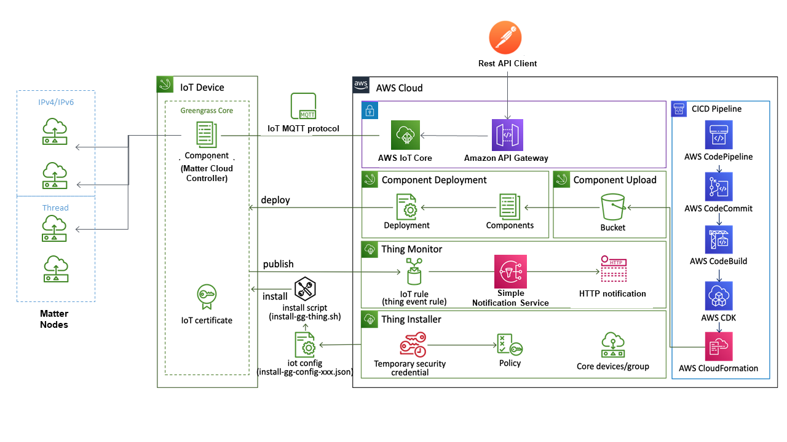
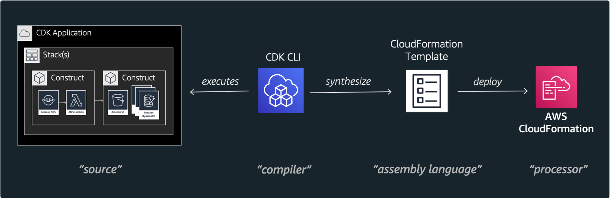

# Matter Cloud Controller

The Matter Cloud Controller provides a REST based API that allows you to commission Matter devices into a matter network and to communicate with these nodes using the Matter Interaction model and associated messages via secure cloud communication. Note, this is currently a project in development and should not be considered suitable for immediate production deployment.

## Solution Architecture

The solution consists of 2 key subsystems. The **AWS Cloud** subsystem provides the secure communication channels that are required for the security of this project and the **IoT device** hosts the matter cloud controller. The **IoT device** is currently designed to be hosted on a low cost Raspberry Pi 4 Model B which is a popular platform for building Internet of Things (IoT) projects.

The solution consists of the following:
- Matter nodes locally communicate with the Matter Cloud Controller on the **IoT Device** over a local IPv4/IPv6 or Thread based networks.
- The Matter Cloud controller is a python based program hosted on a AWS greengrass v2 IoT thing that leverages the [Project CHIP](https://github.com/project-chip/connectedhomeip) chip python libraries to act as a controller.
- The Matter Cloud Controller component will listen for MQTT messages that are sent via the AWS API gateway and transferred over the AWS IOT Core secure environment. These MQTT messages originate from the REST API clients and contain CHIP type interaction messages such as "discover" and "commission" to discover and commission Matter devices onto the Matter Cloud Controllers fabric. 
- The Matter Cloud Controller will maintain the state of each Matter node in a "digital twin" as an AWS named shadow in the AWS IOT code environment.
- When a Matter node is commissioned the Matter Cloud Controller subscribes to changes on this commissioned node. This reduces the need to poll for state changes which would be problematic for power constrained devices that could be "sleepy mode".
- When changes are made on a matter endpoint (e.g. change of ACL), the Matter Cloud Controller will receive a subscription event. This will result in the controller reading the state of the matter node endpoint and updating the state of its "digital twin" (i.e. AWS named shadow) 
- The REST API client can retrieve the state of each commissioned matter node by calling a REST API to get the state in a JSON document.
- To prevent the need for the REST API client to poll for changes, an AWS IoT rule listens for changes to the named shadow state and will then invoke the Subscriptipn Notification Service (SNS) to call a Webhook API in the REST client. This webhook will be called every time the state of a named shadow is changed.
- The AWS API gateway provides secure REST API endpoints. Securing the AWS API Gateway is done using AWS IAM roles, API keys and signed/authenticated requests/responses.

One advantage of using AWS named shadows as "Digital Twins" for real matter nodes is that this allows the solution to be robust and reliable for intermittent network conditions between the cloud and the Matter network. For example, if matter nodes are in a environment that is susceptible to network dropouts or network connectivity loss (e.g. a transport vehicle or remote locations) this solution will provide the last known state to the REST API clients and when network connectivity is restored the recent state changes will be propagated to the AWS IoT Core. 

Another significant advantage of using AWS IoT Core and a AWS greengrass v2 based solution is that software and device firmware updates can be easily made to the Matter Cloud Controller and, in turn, to the Matter devices. This could provide a solution to secure cloud originated Device Firmware Updates (DFU) using the Matter OTA standard.

## Automated Provisioning 

The remainder of the solution architecture provides automatic provisioning of the cloud infrastructure necessary for the solution. This is referred to Infrastructure As Code (IaC). This efficiently defines and provisions aws cloud resources using [AWS Cloud Development Kit(CDK)](https://aws.amazon.com/cdk) which is an open source software development framework to define cloud application resources. The benefit of this approach is that the cloud infrastructure can be provisioned and de-provisioned with confidence and repeatability. The required cloud resources are defined in code based "constructs" which are part of this project repository. The CDK API from AWS provides that functionality to "Synthesize" these constructs into Cloud Formation templates which can then be deployed to create the required AWS resources.

The solution components for deployment and provisioning are:
- Thing Installer: provides Greengrass ver2 Installer with a customized IAM Role(output-thing-installer-stack-MCCDev.json)
- Thing Monitor: observe IoT thing lifecycle events(created, deleted, updated) and triggers Subscription Notifications resulting in Webhook calls.
- Component Upload/Deployments: deploys component (matter cloud controller)
- S3 Buckets: stores deployment component code
- IoT certificate: A secure digital certificate based encrypted channels is created between the AWS IoT Core environment and the IoT device that hosts the Matter Cloud Controller. This is important to provide security that is required for a cloud based solution.

Inspiration for the stack provisioning for this project came from the "AWS IoT Greengrass OnBoarding and Data Logging using AWS CDK" example from Amazon Web Services https://github.com/aws-samples/aws-iot-greengrass-v2-using-aws-cdk. Full credit to the Amazon team for providing such an excellent example to base this solution on.

## Building the Environment
Follow this guide to [Building the AWS Environment](./docs/BUILDING.md)

## Testing the Matter Cloud Controller
Follow this guide to [Testing the Matter Cloud Controller](./docs/TESTING.md)

#

# Current Status of the Matter Cloud Controller

The overall goal of this project is to provide an open source project that can
further advance the functionality of the Matter technology environment and, in 
doing so, further improve the benefits of Matter to consumers and manufacturers.
The Matter Cloud Controller design and technology is currently aligned to the
technology provided by Amazon Web Services. This should not be seen as an
exclusive choice of cloud environment. In future releases, other cloud
environments will be supported where possible. The current functionality provides
basic matter interactions such as discovery, commissioning and interactions. 
The current matter cloud controller focuses on endpoint 0 of the device nodes to monitor
and manage adminstration type information for devices. The project will be 
extended to support clusers outside of endpoint 0 in future releases. A decision 
was made early in the development of this project to leverage the Project CHIP python 
libraries and this should mean that additional functionality should be easily ported 
into this solution as the project chip feature set grows. Testing of this project has 
been done locally using the project chip examples on a limited set of matter development 
platforms such as Nordic's NRF52840-DK, Espressif's ESP32 platforms and Linux. Further 
testing of consumer matter products will be required as these devices become available 
and when multi-admin is made available by the main smart home eco-systems. Also more 
automated testing will be added as the project progresses.

# How to Contribute

We welcome your contributions to the Matter Cloud Controller. Read our contribution guidelines
[here](./CONTRIBUTING.md).

# Building and Developing the Matter Cloud Controllers

Instructions about how to build the Matter Cloud Controllers can be found [here](./docs/BUILDING.md) .

# Directory Structure

The Matter Cloud Controller repository is structured as follows:

| File/Folder        | Content                                                            |
| ------------------ | ------------------------------------------------------------------ |
| cdk.out            | generated output directory for Cloud Formation Templates           |
| config             | Project configurations                                             |
| docs               | Documentation, including guides                                    |
| infra              | Construct code in Typescript that defines the infrastructure       |
| integrations       | integrations - mainly containing docker integration files          |
| lib                | Library of provided construct code to help to build infra          |
| logs               | Local logging location used during development and test            |
| scripts            | Scripts needed to work with the environment                        |
| src                | Implementation of Matter Cloud Controller Component                |
| test               | Tests (to be done)                                                 |
| cdk.json           | Config for the CDK CLI                                             |
| CODE_OF_CONDUCT.md | Code of conduct for this project and contribution to it            |
| CONTRIBUTING.md    | Guidelines for contributing to this project                        |
| LICENSE            | Matter Cloud Controller license file                               |
| REVIEWERS.md       | PR reviewers                                                       |
| requirements.txt   | Python library requirement (also file for dev).                    |
| README.md          | This File                                                          |

# License

Matter Cloud Contoller is released under the [Apache 2.0 license](./LICENSE).