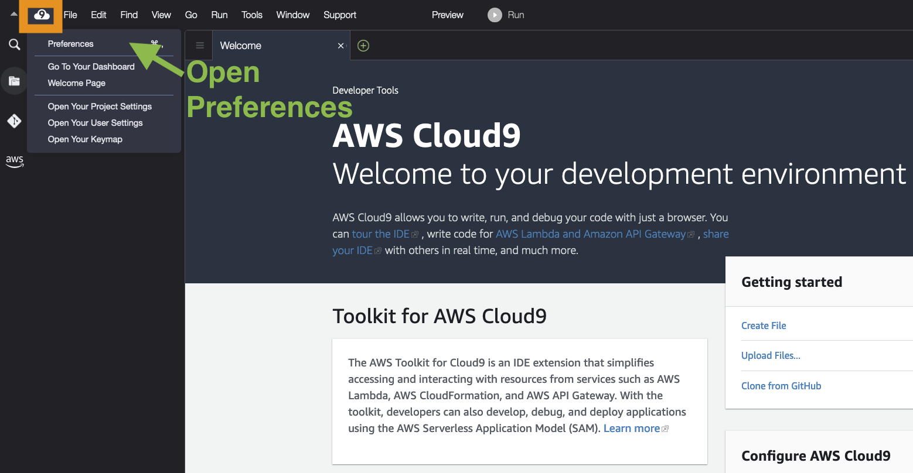
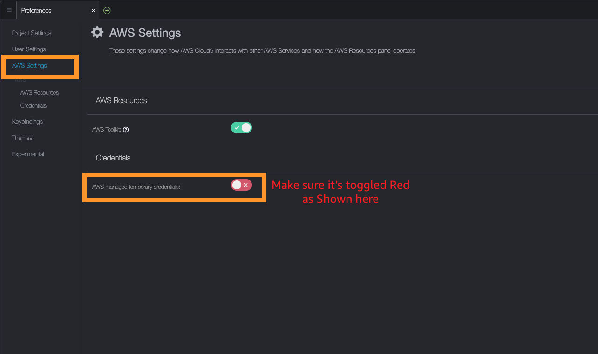

# Using an AWS Cloud9 instance
This section describes how to run this guide in an AWS Cloud9 IDE instance. The AWS Cloud9 IDE runs on an Ubuntu EC2 instance. Ubuntu Linux is used as operating system and the standard user is named "ubuntu".

The [AWS Cloud9 IDE](https://aws.amazon.com/cloud9/) offers a rich code-editing experience with support for several programming languages and runtime debuggers, and a built-in terminal. It contains a collection of tools that you use to code, build, run, test, and debug software and helps you release software to the cloud.

You access the AWS Cloud9 IDE through a web browser.

The AWS Command Line Interface (awscli) will be installed and configured on the AWS Cloud9 Instance. If the instructions refer to the awscli use the one that is installed on the Cloud9 instance.

**Make sure that you execute the awscli (aws) as ubuntu. It is only configured for this user on the Cloud9 instance.**

## 1. Disable AWS Cloud9 temporary credentials
Cloud9 uses temporary credentials by default. Let's disable them as we will be using our own IAM user or Event engine provided credentials.

Open Preferences under the Cloud9 icon and navigate down to AWS Settings in the bar on the left.
Uncheck 'AWS managed temporary credentials'.

Once done, please close the Preferences tab

That's all for this procedure.