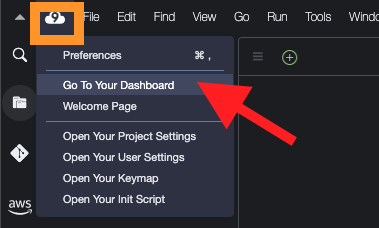

#Now let’s set up the AWS credentials that you will need for this project deployment ...

Create an IAM user using [AWS IAM Console](https://console.aws.amazon.com/iam/)  by going to Cloud9 dashboard and selecting IAM service.

1. From IAM Dashboard, click Users then choose Add users
- Enter a user name that you will remember later. For this guide enter the name ggc_user
- Check Programmatic access and then click on Next: Permissions.

2. Click on Attach existing policies directly

3. Attach 'AdministratorAccess' policy - *Note This is for workshop usage only! (not to be used in Production environment)

4. Click through keeping default settings as presented and finally select Create user

5. Once user is created download the CSV file as it contains the details we will need to configure AWS credentials.

You can now use these details to populate AWS Credentials in Cloud9 environment or in your local Linux environment. You can now proceed with the [CDK-Project Build & Deploy](./BUILDING.md#cdk-project-build--deploy)

