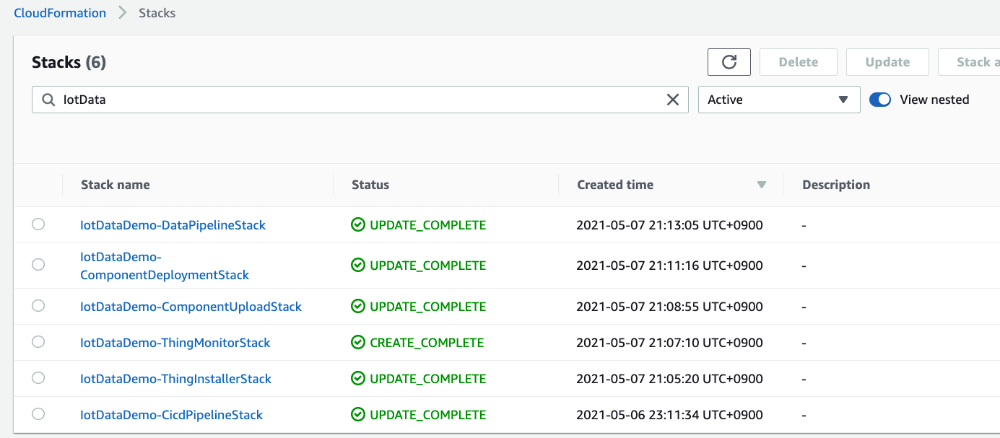
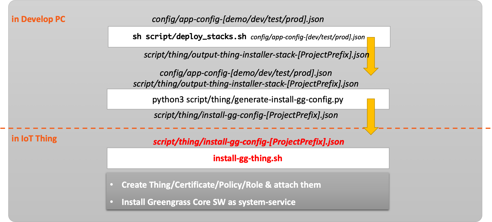
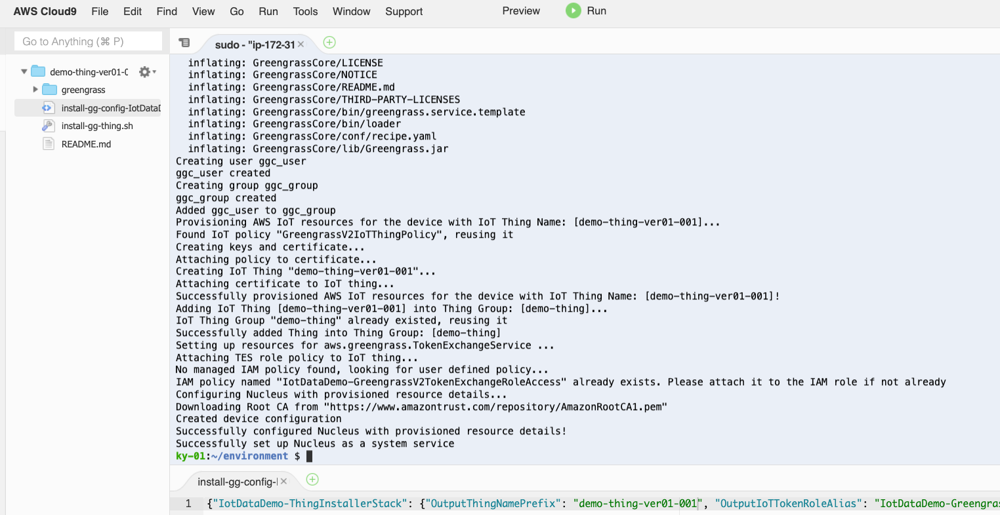
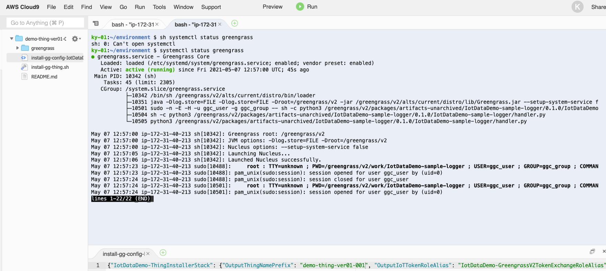
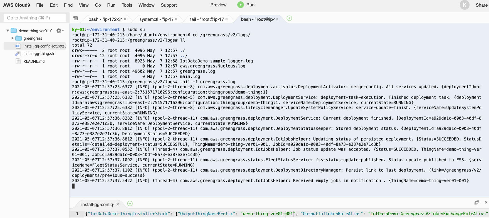

<p>Health Warning: this is work in progress</p>

# Building the Matter Cloud Controller


## CDK-Project Build & Deploy

To efficiently define and provision aws cloud resources, [AWS Cloud Development Kit(CDK)](https://aws.amazon.com/cdk) which is an open source software development framework to define your cloud application resources using familiar programming languages is utilized.


Because this solusion is implemented in CDK, we can deploy these cloud resources using CDK CLI. Among the various languages supported, this solution used typescript. Because the types of **typescript** are very strict, with the help of auto-completion, typescrip offers a very nice combination with AWS CDK.

***Caution***: This solution contains not-free tier AWS services. So be careful about the possible costs.

### **Prerequisites**

First of all, AWS Account and IAM User is required. And then the following modules must be installed.

- AWS CLI: aws configure --profile [profile name]
- Node.js: node --version
- AWS CDK: cdk --version
- [jq](https://stedolan.github.io/jq/): jq --version
- boto3

```bash
pip install -r ./requirements_dev.txt
```

if not installed you can use the command:

Please refer to the kind guide in [CDK Workshop](https://cdkworkshop.com/15-prerequisites.html).

### ***Configure AWS Credential***

```bash
aws configure --profile [your-profile] 
AWS Access Key ID [None]: xxxxxx
AWS Secret Access Key [None]:yyyyyyyyyyyyyyyyyyyyyyyyyyyyyy
Default region name [None]: eu-west-1 
Default output format [None]: json
    
aws sts get-caller-identity --profile [your-profile]
...
...
{
    "UserId": ".............",
    "Account": "75157*******",
    "Arn": "arn:aws:iam::75157*******:user/[your IAM User ID]"
}
```

### ***Check cdk project's default launch config***

The `cdk.json` file tells CDK Toolkit how to execute your app.

### ***Set up deploy config***

The `config/app-config.json` files tell how to configure deploy condition & stack condition. First of all, change project configurations(Account, Profile are essential) in ```config/app-config.json```.

```json
{
    "Project": {
        "Name": "MCC",
        "Stage": "Dev",
        "Account": "75157*******",
        "Region": "eu-west-1",
        "Profile": "ggcuser"
    },
    ...
    ...
}
```

And then set the path of the configuration file through an environment variable.
Note: You must be in the aws-cdk directory. You only need to run this script when setting up the environment

```bash
export APP_CONFIG=config/app-config.json
```

### ***Install dependecies & Bootstrap***

```bash
sh ./scripts/setup_initial.sh config/app-config.json
```

### ***Pack IoT Greengrass components***

```bash
sh ./scripts/pack_components.sh config/app-config.json
```

Check whether ***zip*** directory and file are created in ***src/component/sample***.

### ***Deploy stacks(1st provisioning)***

Before deployment, check whether all configurations are ready. Please execute the following command.

```bash
cdk list
...
...
==> CDK App-Config File is config/app-config.json, which is from Environment-Variable.
==> Repository Selection:  CodeCommit
MatterControllerDev-ComponentDeploymentStack
MatterControllerDev-ComponentUploadStack
MatterControllerDev-MccInstallerStack

```

Check if you can see the list of stacks as shown above.

If there is no problem, finally run the following command.

```bash
sh ./scripts/deploy_stacks.sh config/app-config.json
```

You can check the deployment results as shown in the following picture.



### ***Destroy stacks***

Execute the following command, which will destroy all resources except S3 Buckets. So destroy these resources in AWS web console manually.

```bash
sh ./scripts/destroy_stacks.sh config/app-config.json
```

### ***CDK Useful commands***

* `npm install`     install dependencies
* `cdk list`        list up stacks
* `cdk deploy`      deploy this stack to your default AWS account/region
* `cdk diff`        compare deployed stack with current state
* `cdk synth`       emits the synthesized CloudFormation template

## How to install thing

### Generate `install-gg-config-[ProjectPrefix].json`

Please prepare `install-gg-config-[ProjectPrefix]`.json file, where ***[ProjectPrefix]*** is "Project Name" + "Project Stage" in ***app-config.json***. For example, ***MCCDev*** is [ProjectPrefix] in this default ***app-config.json***.

```bash
sh ./scripts/deploy_stacks.sh config/app-config.json # generated-> ./scripts/thing/output-thing-installer-stack-[ProjectPrefix].json
python3 ./scripts/thing/generate-install-gg-config.py -a config/app-config.json -t ./scripts/thing/output-thing-installer-stack-[ProjectPrefix].json # generated-> ./scripts/thing/install-gg-config-[ProjectPrefix].json

#Do this the first time when run to update the iot policy to allow iot shadow interactions
python3 ./scripts/thing/update_iot_policy.py -a config/app-config.json -p '{"Version": "2012-10-17","Statement": [{"Effect": "Allow","Action": ["iot:GetThingShadow","iot:UpdateThingShadow","iot:DeleteThingShadow","iot:Connect","iot:Publish","iot:Subscribe","iot:Receive","greengrass:*"],"Resource": "*"}]}' 

```



Check whether ***install-gg-config-[ProjectPrefix].json*** is created in ***./scripts/thing*** directory.

### Transfer a config file into target device and execute a script in target devices

* ```./scripts/thing/install-gg-config-[ProjectPrefix].json```
* ```./scripts/thing/install-gg-thing.sh```

### Install Greengrass

1. Update a unique thing name in ***install-gg-config-[ProjectPrefix].json***

```bash
{
    "MCCDev-ThingInstallerStack": {
        "OutputThingNamePrefix": "demo-thing-ver01-001", <--- append a extra & unique suffix thing name !!
        "OutputIoTTokenRoleAlias": "MCCDev-GreengrassV2TokenExchangeRoleAlias",
        "OutputInstallerTempRoleARN": "arn:aws:iam::75157*******:role/MCCDev-InstallerTempRole",
        "OutputThingGroupName": "demo-thing",
        "OutputIoTTokenRole": "MCCDev-GreengrassV2TokenExchangeRole",
        "OutputProjectRegion": "eu-west-1",
        "OutputProjectPrefix": "MCCDev"
    },
    "Credentials": {
        "AccessKeyId": "******************",
        "SecretAccessKey": "88888888888888888888888888888888",
        "SessionToken": "FwoGZXIvYXdzELn//////////wEaDDiSD0li77wnn+e1NiK/Ae7CoclJAt4dV0diah/AjCwUUeRf44dtGVWFw7ZQDkBj732rFTcc5/FLL3+GcEDlAw4VUso5tG6dI/JVwzWBWnKDk9UWF4QBnCVYxSp9Jpcup06eJ44NYhuMMA8KTSY+Ea9Kf2JAVvG4hVKGEteJwU+lC5tUkuhcLtKaAuTdxefc6jyH9qfmIJcUfjpeDNm9+3OHOhsQrTWE+4a4VYgTP5PR7w7ouWNktlE5X/1z3L+sQ7D8rmtcZdgLef4h3+E2KMOQ0IQGMi2UR6B/e4Pj4ybeLdXk62+p3alCLzPNWo/Nh2N9nbak9FTb2TRk70WiFGT5jJ0=",
        "Expiration": "2021-05-06 16:16:19+00:00"
    },
    "ProjectPrefix": "MCCDev"
}
```

2. Install a Open JDK (headless Java JDK) on raspberry pi and confirm the installation
```
sudo apt install default-jdk-headless
java -version
```

3. Run the following commands

First, if not already done so, create some directories, the python virtual env

```
mkdir -p /home/ubuntu/mattercloudcontroller/scripts/thing
cd /home/ubuntu/mattercloudcontroller/scripts/thing
wget https://raw.githubusercontent.com/oidebrett/mattercloudcontroller/main/scripts/thing/install-gg-thing.sh .
```

then activate the python virtual env
```bash
source /home/ubuntu/connectedhomeip/out/python_env/bin/activate

```

4. Copy over the config details from your installation PC and store the contents in a new file install-gg-config-[ProjectPrefix].json


4. Then Run the following commands

```bash
sh ./install-gg-thing.sh install-gg-config-[ProjectPrefix].json
```

5. Make sure your main user account is add to the ggc_group:

```bash
sudo usermod -a -G ggc_group ubuntu
```

and that the ubuntu directory has grouped permissions set

```bash
sudo chown -R ubuntu:ggc_group /home/ubuntu/
```

```bash
sudo systemctl restart greengrass
```

Result of install-script


Result of Greengrass-installation


Result of Greengrass-deployment


### Check greengrass system-service

```bash
sudo systemctl status greengrass
```

Result of Greengrass-service


### Check greengass log

```bash
sudo tail -f /greengrass/v2/logs/greengrass.log
sudo tail -f /greengrass/v2/logs/MCCDev-mcc-daemon.log
```

Result of Greengrass-log



Note that when code changes are made, be sure to increase component's version in ```config/app-config.json``` and then re-create the zip file in ```src/component/sample/zip``` using the following command.

```bash
sh ./script/pack_components.sh config/app-config.json
```

After updating your logic, just git push the changes! And then CICD pipeline will automatically deploy that through Github Action & Greengrass deployments.

Or you can directly deploy those in local-dev PC using AWS CDK CLI like this.

```bash
sh ./script/deploy_stacks.sh config/app-config-demo.json
```

## Building and installing the local python matter controller

Before you can use the Matter cloud controller, you must install the connected home over ip library

To build and run the Matter Cloud controller:

1. Build and install the Python CHIP repl tool :

    ```
    [Follow the instructions for CHIP Repl Tool](https://github.com/project-chip/connectedhomeip/blob/interop_testing_te9/docs/guides/python_chip_controller_building.md#building)
    ```

<hr>

# Control Device Setup

1. On raspberry pi 4 (4GB). Download Ubuntu Server 21.10 using RPI imager on a 64 GB micro SD card. Note 21.04 is no longer available.

2. Follow build instructions "Building Matter" from GitHub.com/NRFConnect/sdk-connectedhomeip
Note: ensure that the versions are aligned between nrf app and chip controller
e.g. if nrf version is v1.9.0 then git checkout v1.9.0 of sdk-connectedhomeip

2.1 In order to speed up the compilation and reduce risk of pi hanging you might consider adding 4GB as swap as per https://www.linuxtut.com/en/71e3874cb83ed12ec405/

3. Ensure router advertising is enabled on raspberry pi controller
```
sudo sysctl -w net.ipv6.conf.wlan0.accept_ra=2
sudo sysctl -w net.ipv6.conf.wlan0.accept_ra_rt_info_max_plen=64
```
4. If having difficulties try these steps:

Remove temp files
```
sudo rm -rf /tmp/chip*
```

Clear out MDNS cache on OTBR
```
sudo systemctl restart mdns.service 
```

Clear out avahi MDNS cache on Raspberry Pi
```
sudo systemctl restart avahi-daemon.socket 
```

  

## How to setup the ubuntu environment properly for the matter cloud controller pi

after you have cloned the repo and installed the submodules then

'''
scripts/build_python.sh -m platform -i separate
'''

then on a seperate laptop build the all clusters app variant that has only ipv6 (this is to simulate what will be the most probably interface for all devices post commissioning by other fabric)

'''
./scripts/run_in_build_env.sh "./scripts/build/build_examples.py --target linux-x64-all-clusters-no-ble-asan-clang build"

'''

then we have to 

Activate the Python virtual environment:

'''
source out/python_env/bin/activate
'''

Verify the install by Launching the REPL.

'''
sudo out/python_env/bin/chip-repl
'''


# Preventing  docker image from overwriting the persistent storage

We had 2 options:
Option 1: preventing the host raspberry pi from clear /tmp and mounting the /tmp directory as volume between host and docker container
Option 2: specifying the persistent storage as a file in the /var/tmp directory which is not cleared on reboot

We decided for Option 2 so as not to change the defauld file handling procedures of ubuntu

Option 1
By default the persistent storage (containing info on all commissioned devices) is stored in /tmp/repl-storage.txt. 
When the docker image is restarted the tmp directory is cleared
To avoid this we have pervented the tmp directory being cleared on the host raspberry pi by following these steps:
1. Copied /usr/lib/tmpfiles.d/tmp.conf to /etc/tmpfiles.d/tmp.conf
2. Edited /etc/tmpfiles.d/tmp.conf

changed
D /tmp 1777 root root -
to
d /tmp 1777 root root -

Then we have mounted the \tmp as a volume in the docker compose so that the host and the image container share the same \tmp file
This ensures that 1) the tmp isnt cleared when the raspberry pi is restarted and 2) that the docker image picks up the persisted info on commissioned devices

Option 2:
We specify the persistent storage as a command argument in the python script for the greengrasss component