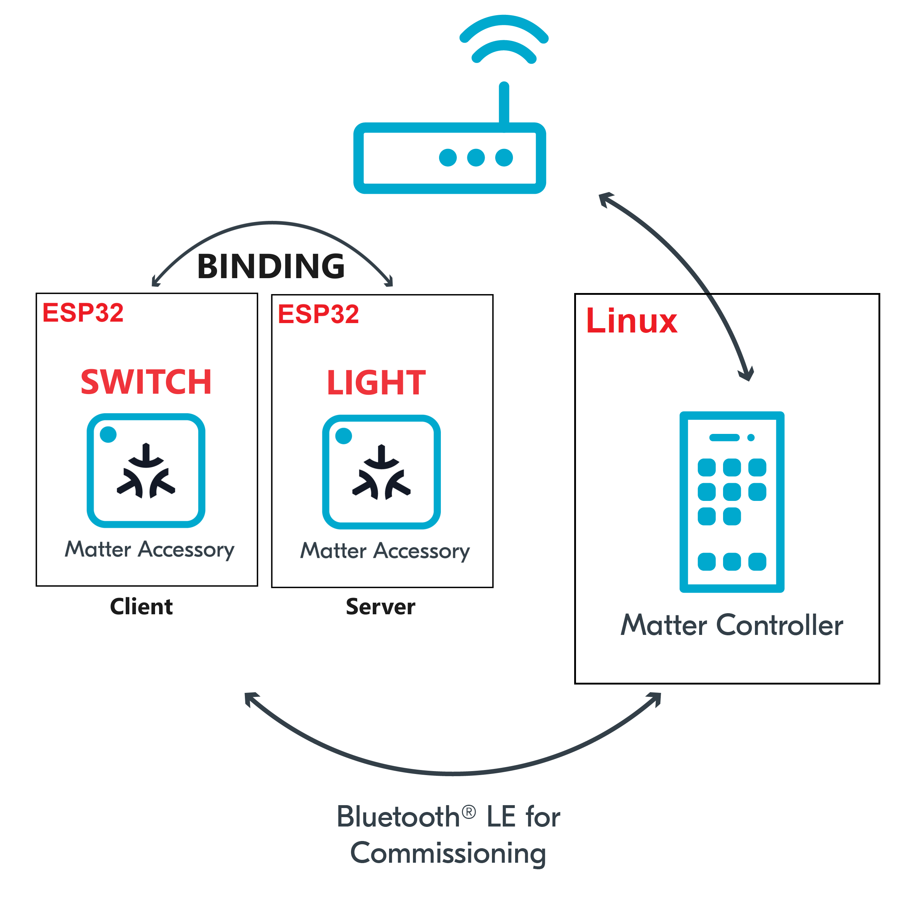

summary: How to bind a switch to a light on esp32
id: how-to-bind-a-switch-to-a-light-on-esp32
categories: Sample
tags: matter
status: Published 
authors: MatterCoder
Feedback Link: https://mattercoder.com

# How to bind a switch to a light on esp32
<!-- ------------------------ -->
## Overview 
Duration: 25

In this codelab we will show you how to bind a Matter switch to a Matter sample light app on the ESP32.

### What You’ll Build 
In this codelab, you will:
- Run a sample Matter Switch app on the ESP32
- Run the Matter light you created on another ESP32
- Use a Matter Switch to controller a Matter light
- Use the chip-tool as a Matter controller to controller the Light.

### Architecture


In this CodeLab we will run a Matter Switch on a ESP32 microcontroller, a Matter Light on another ESP32 and the Matter Controller on a Linux Host. This will allow us to create a simple Matter Network very quickly and we will learn how to bind a Matter switch to a Matter light.

### What You’ll Learn 
- What you will need (Pre-requisities)
- How to control Access Control on a Matter accessory
- How to bind a Switch to a Light
- How to control a light from a Switch.

<!-- ------------------------ -->
## What you will need (Pre-requisities)
Duration: 2

This set of Codelabs will use `Ubuntu 22.04` on a Amd64 based architecture.

You will need
- 2 ESP32 microcontrollers. ESP32 DEV KIT C
- a laptop or PC running `Ubuntu 22.04` with a Bluetooth interface
- Visual Studio Code IDE
- a basic knowledge of Linux shell commands
- the Matter light and Matter switch app built in previous codelabs

The total codelab will take approximately a `Duration of 30 minuates` to complete. 

<!-- ------------------------ -->
## Flash the Matter Switch to an ESP32 
Duration: 2

You should have built the Matter switch in a previous codelab.

1. The first thing to do is set up the ESP Matter SDK and the ESP-IDF environments (you should do this step everytime you open a new terminal)

```shell
cd esp-idf
source ./export.sh
cd ..
cd esp-matter
source ./export.sh
```

2. We will navigate to the Matter Switch example.

```shell
cd examples/light_switch/
```

3. You will then flash the Matter Switch image on to the ESP32. But its good practice to erase the flash before hand.

```shell
idf.py -p /dev/ttyUSB0 erase_flash
idf.py -p /dev/ttyUSB0 flash monitor 
```


<!-- ------------------------ -->
## Commissioning the ESP32 matter switch app using chip-tool
Duration: 2

In this section we will pair our ESP32 matter switch application on the ESP32 using the chip-tool that acts as a matter controller.

### Verifying connections with the CHIP Tool
Firstly we will check if the CHIP Tool runs correctly. Execute the following command in the connectedhomeip directory:

```shell
./out/host/chip-tool
```

As a result, the CHIP Tool will print all available commands. These are called clusters in this context, but not all listed commands correspond to the clusters in the Data Model (for example, pairing or discover commands).

### Pairing the Switch using the CHIP Tool
1. In the same shell window, try to commission the matter accessory using the the CHIP Tool. Commissioning is what we call the 
process of bringing a Matter Node into a Matter Fabric. Essentially, we are creating a secure relationship between the Matter 
Controller (chip-tool) and the Matter Accessory (switch-app).

```shell
./out/host/chip-tool pairing ble-wifi 4 ${SSID} ${PASSWORD} 20202021 3840
```

If everything is working you should see output logs and you should see that the commissioning was successful

```shell
[1683309736.149316][15:17] CHIP:CTL: Successfully finished commissioning step 'Cleanup'
[1683309736.149405][15:17] CHIP:TOO: Device commissioning completed with success
```

3. Now that we have created a secure relationship by "commissioning" the matter accessory we will now do some simple interaction with the Matter Accessory using the chip-tool as a Matter controller. We will get into further details  of the "interaction model" and "data model" of Matter in later codelabs. But for now, we will do some simple interactions.

In the same shell window, we will read the vendor-name of the Matter accessory using the following command:

```shell
./out/host/chip-tool basicinformation read vendor-name 4 0
```

In the output logs, you should see that the Vendor Name

```shell
[1682445848.220725][5128:5130] CHIP:TOO:   VendorName: TEST_VENDOR
```

<!-- ------------------------ -->
## Flash the Matter Light to an ESP32 
Duration: 2

You should have coded and built the Matter light in a previous codelab.

1. We will navigate to the Matter Light that you had previously coded.

```shell
cd ~/Projects/starter-esp-matter-app/
```

2. You will then flash the Matter Light image on to the other ESP32. But its good practice to erase the flash before hand.

```shell
idf.py -p /dev/ttyUSB1 erase_flash
idf.py -p /dev/ttyUSB1 flash monitor 
```

<!-- ------------------------ -->
## Commissioning the ESP32 matter light app using chip-tool
Duration: 2

In this section we will pair our ESP32 matter light application on the ESP32 using the chip-tool that acts as a matter controller.

### Verifying connections with the CHIP Tool
Firstly we will check if the CHIP Tool runs correctly. Execute the following command in the connectedhomeip directory:

```shell
./out/host/chip-tool
```

As a result, the CHIP Tool will print all available commands. These are called clusters in this context, but not all listed commands correspond to the clusters in the Data Model (for example, pairing or discover commands).

### Pairing the Switch using the CHIP Tool
1. In the same shell window, try to commission the matter accessory using the the CHIP Tool. Commissioning is what we call the 
process of bringing a Matter Node into a Matter Fabric. Essentially, we are creating a secure relationship between the Matter 
Controller (chip-tool) and the Matter Accessory (light-app).

```shell
./out/host/chip-tool pairing ble-wifi 1 ${SSID} ${PASSWORD} 20202021 3840
```

If everything is working you should see output logs and you should see that the commissioning was successful

```shell
[1683309736.149316][15:17] CHIP:CTL: Successfully finished commissioning step 'Cleanup'
[1683309736.149405][15:17] CHIP:TOO: Device commissioning completed with success
```

3. Now that we have created a secure relationship by "commissioning" the matter accessory we will now do some simple interaction with the Matter Accessory using the chip-tool as a Matter controller. We will get into further details  of the "interaction model" and "data model" of Matter in later codelabs. But for now, we will do some simple interactions.

In the same shell window, we will read the vendor-name of the Matter accessory using the following command:

```shell
./out/host/chip-tool basicinformation read vendor-name 1 0
```

In the output logs, you should see that the Vendor Name

```shell
[1682445848.220725][5128:5130] CHIP:TOO:   VendorName: TEST_VENDOR
```

<!-- ------------------------ -->
## Binding the ESP32 matter light app to the ESP32 switch using chip-tool

After commissioning, the next step is to bind Matter device (Light) with the Matter switch and control them via the Boot button on the Matter Switch.

1. Set up the Access Control on the Matter Light

Utilizing chip-tool to write access control to the Matter light device in order to control through ESP-BOX Matter Switch.

For Light:

```shell
./chip-tool accesscontrol write acl '[{"fabricIndex": 1, "privilege": 5, "authMode": 2, "subjects": [ 112233, 4 ], "targets": null}]' 1 0x0
```

An explanation of the parameters used in this command is below:

The privileges are:
- View: 1, Operate: 3, Manage: 4, Administer: 5

The authentication modes are:
- CASE: 2, Group: 3

The Subjects is a list containing zero, one, or more subject identifiers, which are:
- Node ID for CASE auth mode, Group ID for Group auth mode

Targets: 
We could select a particular cluster that this access control list entry applies to such as
{cluster:onoff}, {endpoint:1}, {cluster:levelcontrol,endpoint:2} or leave it at Null.

Our command is allowing the chip-tool (node id 112233) and the Matter Switch (node id 4) to Administer
the light using CASE (certificate Authenticated Session Establishment). Since we have specified no targets, 
this ACL will apply to all clusters on the Matter Light.


2. Update device binding attribute to the Matter Switch

To update the Matter Switch binding attribute and add an entry for a remote device (Matter Light) to the binding table, use the following command:

For Light:

```shell
./chip-tool binding write binding '[{"fabricIndex": 1, "node":1, "endpoint":1, "cluster":6}]' 4 0x1
```

This particular command has bound the Switch to the NodeId 1 (Matter Light) on endpoint 1 and cluster 6 (onOff cluster).

<!-- ------------------------ -->
## Controlling the Matter light using the Matter switch

We can now control the Matter light using the Matter switch which is entirely independent of the chip-tool.

1. Press the Boot button on the Matter Switch
You should see the Light turning on or off.

2. Check the status of the Matter Light using the chip-tool. 
You should see the On attribute on the Matter light OnOff cluster change everytime time the Light switch is pressed.

```shell
./chip-tool onoff read on-off 1 0x1
```

### Cleaning Up
You should stop the switch-app process by using Ctrl-] in the first esp32 monitor window, the light-app process by using Ctrl-] in 
the second esp32 monitor window and then run idf erase flash.

It also a great habit to clean up the temporary files after you finish testing by using this command:
```shell
rm -fr /tmp/chip_*
```
Note: removing the /tmp/chip* files can sometimes clear up unexpected behaviours.


<!-- ------------------------ -->
## Further Information
Duration: 1

Checkout the official documentation [Espressif Matter SDK documentation here: ] (https://docs.espressif.com/projects/esp-matter/en/latest/esp32/)

Also check out the Project CHIP Matter SDK repo [Project Chip - ConnectedHomeIp](https://github.com/project-chip/connectedhomeip/tree/master/docs)

