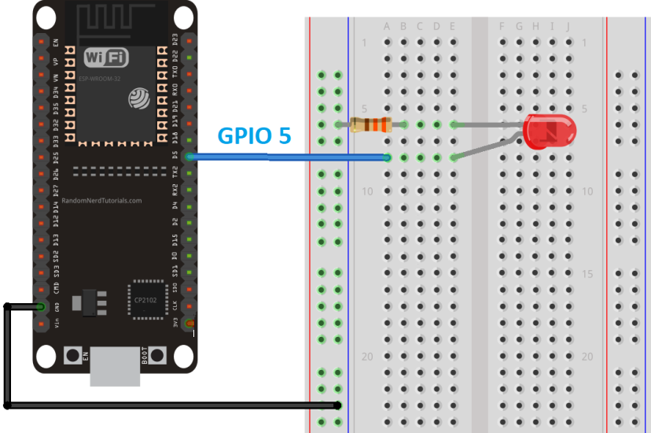

summary: How to create a matter app on esp32
id: how-to-create-a-matter-app-on-esp32
categories: Sample
tags: matter
status: Published 
authors: MatterCoder
Feedback Link: https://mattercoder.com

# How to Create a Matter app on esp32
<!-- ------------------------ -->
## Overview 
Duration: 25

In this codelab we will show you how to build and install the all-clusters-app on the ESP32.

### What You’ll Build 
In this codelab, you will:
- Build a sample Matter Accessory on the ESP32
- Use the chip-tool as a Matter controller to controller the accessory.

### Architecture


in this CodeLab we will run the Matter Accessory on an ESP32 microcontroller and the Matter Controller on a Linux Host. This will allow us to create a simple Matter Network very quickly and we will learn how to commission Matter devices over BLE.

### What You’ll Learn 
- What you will need (Pre-requisities)
- Where to get the latest version of ESP-IDF toolchain
- How to build a sample matter app on the ESP32
- Basic testing with sample app and chip-tool

<!-- ------------------------ -->
## What you will need (Pre-requisities)
Duration: 2

This set of Codelabs will use `Ubuntu 22.04` on a Amd64 based architecture. If you are using Mac OS then you should follow the instructions directly from the [Matter repo](https://github.com/project-chip/connectedhomeip/blob/master/docs/guides/BUILDING.md)

You will need
- an ESP32 microcontroller. ESP32 DEV KIT C
- a laptop or PC running `Ubuntu 22.04` with a Bluetooth interface
- Visual Studio Code IDE
- a basic knowledge of Linux shell commands

The total codelab will take approximately a `Duration of 30 minuates` to complete. 

<!-- ------------------------ -->
## Where to get the latest version of ESP-IDF 
Duration: 2

A guide on how to install ESP-IDF is available on the [ConnectedHomeIP repo](https://github.com/project-chip/connectedhomeip/blob/master/docs/guides/esp32/setup_idf_chip.mdp)

1. First thing we will do is create a new folder so that we can clone the code

```shell
cd ~
mkdir tools
cd tools
```

2. Next we will clone the ESP-IDF github repo. Note the latest version at the time of writing is below. Upgrading to the latest version is recommended.

```shell
git clone -b v5.1.2 --recursive https://github.com/espressif/esp-idf.git
cd esp-idf
git submodule update --init --recursive
```

3. Once the ESP-IDF toolchain is in place you will ensure that the correct submodules 
are updated in the connectedhomeip environment

```shell
cd ~/Projects/connectedhomeip
./scripts/checkout_submodules.py --recursive --force --platform esp32
```

Note: this process can take a while the very 1st time you install matter.


Before building our Matter controller and sample app, we need to install a few OS specific dependencies.


<!-- ------------------------ -->
## How to build a sample matter app for the ESP32 microcontroller
Duration: 10

In this section we will build a sample matter app for the ESP32. 
We will use the sample `Linux lighting app` which has all the main capabilities of a matter light end device. 

We have previously built the matter controller tool that is provided by Project-Chip. You will need
to go back and complete that codelab

1. Before building any matter app or controller we will need to create and initialise
the environment

Run the following commands
```shell
cd ~/Projects/connectedhomeip
source scripts/activate.sh
```

If everything has gone ok with the environment setup you should see:

```shell
Checking the environment:

20250423 16:49:39 INF Environment passes all checks!

Environment looks good, you are ready to go!
```

2. We need to install the esp-idf environment

```shell
cd ~/tools/esp-idf #or where you located your esp-idf environment
./install.sh
source ./export.sh
```

2. We then need to build the matter application for esp

Run the following commands
```shell
cd ~/Projects/connectedhomeip
cd examples/lighting-app/esp32/
idf.py set-target esp32
```

3. We then can build the required sample apps using the following commands

```shell
idf.py build
```

4. If everything worked OK you should see an  Executable Linkable Format file called `chip-lighting-app.elf` in the `build` directory

Note: if you run into any difficulties in can be useful to clean up the temporary build folder using `rm -rf build` as this can often solve some build issues.

5. Adding User to dialout or uucp on Linux
The currently logged user should have read and write access the serial port over USB. On most Linux distributions, this is done by adding the user to dialout group with the following command:

```shell
sudo usermod -a -G dialout $USER
```

6. You will then flash the image on to the ESP32. But its good practice to erase the flash before hand.

```shell
idf.py -p /dev/ttyUSB0 erase_flash
idf.py -p /dev/ttyUSB0 flash monitor 
```

7. Finally, you will create a circuit with an LED connected to GPIO5 that will indicate the status of the light.



<!-- ------------------------ -->
## Basic testing with ESP32 sample app and chip-tool
Duration: 10

In this section we will run a sample matter accessory application (chip-lighting-app) and control with an administrative
tool called the chip-tool that acts as a matter controller.

### Running the CHIP Tool
Firstly we will check if the CHIP Tool runs correctly. Execute the following command in the connectedhomeip directory:

```shell
./out/chip-tool
```

As a result, the CHIP Tool will print all available commands. These are called clusters in this context, but not all listed commands correspond to the clusters in the Data Model (for example, pairing or discover commands).

### Using the CHIP Tool
1. Clean the initialization of state using the following command:
```shell
rm -fr /tmp/chip_*
```
Note: removing the /tmp/chip* files can sometimes clear up unexpected behaviours.

3. In the same shell window, try to commission the matter accessory using the the CHIP Tool. Commissioning is what we call the 
process of bringing a Matter Node into a Matter Fabric. We will explain all of these terms in a further codelab. Essentially,
we are creating a secure relationship between the Matter Controller (chip-tool) and the Matter Accessory (chip-all-clusters-app).

```shell
./out/chip-tool pairing ble-wifi ${NODE_ID_TO_ASSIGN} ${SSID} ${PASSWORD} 20202021 3840
```

If everything is working you should see output logs and you should see that the commissioning was successful

```shell
[1683309736.149316][15:17] CHIP:CTL: Successfully finished commissioning step 'Cleanup'
[1683309736.149405][15:17] CHIP:TOO: Device commissioning completed with success
```

4. Now that we have created a secure relationship by "commissioning" the matter accessory we will now do some simple 
interaction with the Matter Accessory using the chip-tool as a Matter controller. We will get into further details 
of the "interaction model" and "data model" of Matter in later codelabs. But for now, we will do some simple 
interactions/

In the same shell window, we will read the vendor-name of the Matter accessory using the following command:

```shell
./out/chip-tool basicinformation read vendor-name 1 0
```

In the output logs, you should see that the Vendor Name

```shell
[1682445848.220725][5128:5130] CHIP:TOO:   VendorName: TEST_VENDOR
```

6. We can read other information using these commands:
```shell
./out/chip-tool basicinformation read product-name 1 0
./out/chip-tool basicinformation read software-version 1 0
```

We are using the Basic Information `cluster`. Clusters are logical groupings of Matter functionality.

7. We can read other information from another using these commands:
```shell
./out/chip-tool generaldiagnostics read up-time 1 0
```

In the output logs, you should see the UpTime

```shell
[1682446010.495854][5286:5288] CHIP:TOO:   UpTime: 1008
```

8. You can find out the other different clusters that are supported by the chip-tool by running:
```shell
./out/chip-tool 
```

### Cleaning Up
You should stop the chip-all-clusters-app process by using Ctrl-C in the first shell window.

It also a great habit to clean up the temporary files after you finish testing by using this command:
```shell
rm -fr /tmp/chip_*
```
Note: removing the /tmp/chip* files can sometimes clear up unexpected behaviours.


<!-- ------------------------ -->
## Further Information
Duration: 1

Checkout the official documentation here: [Project Chip - ConnectedHomeIp](https://github.com/project-chip/connectedhomeip/tree/master/docs)

