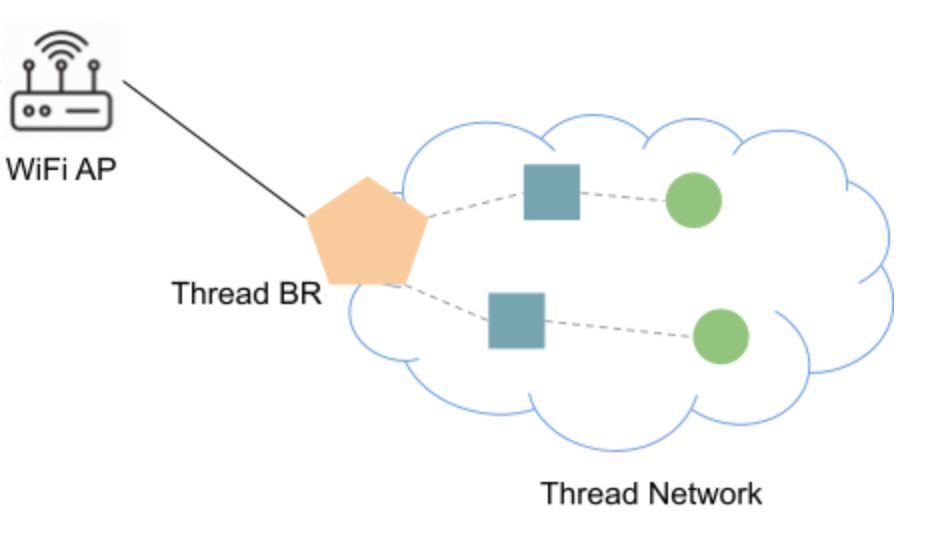
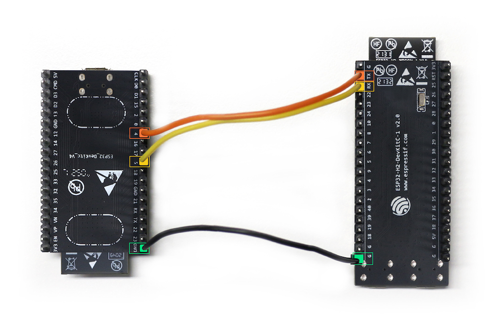

summary: How to Install a Border Router on ESP32
id: how-to-install-border-router-on-esp32
categories: Sample
tags: matter
status: Published 
authors: MatterCoder
Feedback Link: https://mattercoder.com

# How to Install Border Router on Esp32
<!-- ------------------------ -->
## Overview 
Duration: 25

In this codelab we will show you how to build and install an Open Thread Border Router on the esp32 development kits.

### What You’ll Build 
In this codelab, you will:
- Build and install the Open Thread Border Router on ESP32 development kits.
- Learn about the concept of Matter Border Routers

### Architecture


In this CodeLab we will build the Open Thread Border Router (ot_br) on an ESP32 development kit. We will then build and install the Thread Radio Co-processor (ot_rcp) on the ESP32-H2. This will allow us to create a border router between a Wifi and Thread Network. 
In doing so, we will learn how Border Routers work in Matter.

### What You’ll Learn 
- What you will need (Pre-requisities)
- How to set up the ESP32 and ESP32-H2 Thread Border Router
- How to build and install the Open Thread radio co-processor
- How to build and install the Open Thread Border Router
- How to set up a Command Line Interface on a thread device
- How to check commmunication between a Thread and a Wifi/IP Network
- Where you can get more information of the ESP32 Open Thread Border Router

<!-- ------------------------ -->
## What you will need (Pre-requisities)
Duration: 2

This set of Codelabs will use `Ubuntu 22.04` on a Amd64 based architecture. If you are using Mac OS then you should follow the instructions directly from the [Matter repo](https://github.com/project-chip/connectedhomeip/blob/master/docs/guides/BUILDING.md)

You will need
- an ESP32 develoment kit. We will use an ESP32_DEVKITC_V4.
- an ESP32-H2 develoment kit to add support for Thread
- an ESP32-C6 develoment kit to use as a Thread CLI device.
- a laptop or PC running `Ubuntu 22.04` 
- Visual Studio Code IDE
- a basic knowledge of Linux shell commands

The total codelab will take approximately a `Duration of 30 minuates` to complete. 

<!-- ------------------------ -->
## How to set up the ESP32 and ESP32-H2 Thread Border Router
Duration: 5

We will be using the OpenThread Border Router Example application which is available on the [Espressif ESP-IDF github repo for ot_br](https://github.com/espressif/esp-idf/tree/master/examples/openthread/ot_br)

First thing to do is sonnect the two SoCs via UART, below is an example setup with ESP32 DevKitC and ESP32-H2 DevKitC:




The pin outs are as follows:

| ESP32 pin | ESP32-H2 pin |
| ---       | ---          |
| GND       | G            |
| GPIO4     | TX           |
| GPIO5     | RX           |

Note: Once you have built this circuit I would suggest to disconnect the TX pin from the ESP32. I have found that leaving this connected prevents the flashing of the ESP32-H2 board.

<!-- ------------------------ -->
## How to build and install the Open Thread radio co-processor
Duration: 10

We will be using the OpenThread Radio CoProcessor Example application which is available on the [Espressif ESP-IDF github repo for ot_rcp](https://github.com/espressif/esp-idf/tree/master/examples/openthread/ot_rcp)

To run this example, a board with IEEE 802.15.4 module (for example ESP32-H2) is required. We will use the ESP32-H2.

1. First plug in your ESP32-H2 (using the UART not JTAG port) and check which port the board is available on

```shell
ls /dev/ttyUSB*
```

Make note of this device.

2. Then, temporarily, disconnect the TX pin from the ESP32. I have found that leaving this connected prevents the 
flashing of the ESP32-H2 board.

3. We need to initialize the esp-idf environment

```shell
cd ~/Projects/esp-idf #or where you located your esp-idf environment
source ./export.sh
```

4. We will then navigate to the Espressif Open Thread Radio Co-Processor example.
```shell
cd examples/openthread/ot_rcp 
```

5. Set the esp target to be the esp32h2
```shell
idf.py set-target esp32h2
```

6. Build the ot_br example for the esp32-h2
```shell
idf.py build
```

7. If everything worked OK you should see an  Executable Linkable Format file called `esp_ot_rcp.elf` in the `build` directory

Note: if you run into any difficulties in can be useful to clean up the temporary build folder using `rm -rf build` as this can often solve some build issues.

8. Adding User to dialout or uucp on Linux
The currently logged user should have read and write access the serial port over USB. On most Linux distributions, this is done by adding the user to dialout group with the following command:

```shell
sudo usermod -a -G dialout $USER
```

9. Finally, you will then flash the image on to the ESP32-H2. But its good practice to erase the flash before hand

```shell
idf.py -p /dev/ttyUSB0 erase_flash # replace the ttyUSB0 with the correct USB device from above
idf.py -p /dev/ttyUSB0 flash monitor 
```

10. Finally, reconnect the TX pin from the ESP32. This is important.


<!-- ------------------------ -->
## How to build and install the Open Thread Border Router
Duration: 5

We will be using the OpenThread Border Router Example application which is available on the [Espressif ESP-IDF github repo for ot_br](https://github.com/espressif/esp-idf/tree/master/examples/openthread/ot_br)

To run this example, an ESP32 series Wi-Fi SoC (ESP32, ESP32-C, ESP32-S, etc) is required.  In this case, we will use an ESP32 development kit v4.

1. First plug in your ESP32 and check which port the board is available on

```shell
ls /dev/ttyUSB*
```

Make note of this device.

Note: if you have not already created the environment for connectedhomeip and esp-idf install then
follow the steps on the previous page.

2. We will then navigate to the Espressif Open Thread Border Router example
```shell
cd ~/Projects/esp-idf #or where you located your esp-idf environment
cd examples/openthread/ot_br
```

3. Set the esp target to be the esp32
```shell
idf.py set-target esp32
```

4. Build the ot_br example for the esp32
```shell
idf.py build
```

5. If everything worked OK you should see an Executable Linkable Format file called `esp_ot_br.elf` in the `build` directory

Note: if you run into any difficulties in can be useful to clean up the temporary build folder using `rm -rf build` as this can often solve some build issues.


6. Finally, you will then flash the image on to the ESP32-H2. But its good practice to erase the flash before hand

```shell
idf.py -p /dev/ttyUSB1 erase_flash # replace the ttyUSB1 with the correct USB device from above
idf.py -p /dev/ttyUSB1 flash monitor 
```

<!-- ------------------------ -->
## How to set up a Command Line Interface on a thread device
Duration: 5

We will be using the OpenThread CLI Example application which is available on the [Espressif ESP-IDF github repo for ot_cli](https://github.com/espressif/esp-idf/tree/master/examples/openthread/ot_cli)

To run this example, an ESP32 series Wi-Fi SoC (ESP32, ESP32-C, ESP32-S, etc) is required. In this case, we will use a ESP32-C6.

1. First plug in your ESP32-C6 and check which port the board is available on

```shell
ls /dev/ttyUSB*
```

Make note of this device.

Note: if you have not already created the environment for connectedhomeip and esp-idf install then
follow the steps on the previous page.

2. We will then navigate to the Espressif Open Thread CLI example
```shell
cd ~/Projects/esp-idf #or where you located your esp-idf environment
cd examples/openthread/ot_cli
```

3. Set the esp target to be the esp32-c6
```shell
idf.py set-target esp32-c6
```

4. Build the ot_cli example for the esp32
```shell
idf.py build
```

5. If everything worked OK you should see an Executable Linkable Format file called `esp_ot_cli.elf` in the `build` directory

Note: if you run into any difficulties in can be useful to clean up the temporary build folder using `rm -rf build` as this can often solve some build issues.


6. Finally, you will then flash the image on to the ESP32-H2. But its good practice to erase the flash before hand

```shell
idf.py -p /dev/ttyUSB2 erase_flash # replace the ttyUSB2 with the correct USB device from above
idf.py -p /dev/ttyUSB2 flash monitor 
```

## How to check commmunication between a Thread and a Wifi/IP Network
Duration: 5

In this section of the codelab, we will check that we can communicate between our Thread network and the external
IP network. Specifically, we will try to ping the Google DNS servers (which are on the public Internet)

1. In the terminal that is running the CLI example, run the following commands
```shell
factoryreset # the device will reboot
```

2. Set up the Thread network by running the following commands:

```shell
> dataset init new
Done
> dataset commit active
Done
> ifconfig up
Done
> thread start
Done
```
If everything has gone ok you should be able to see that this thread device has become a leader.
This may take a few seconds.

```shell
> state
leader
Done
```

3. Now the first device has formed a Thread network as a leader. Get some information which will be used in next steps.

```shell
> ipaddr
fdde:ad00:beef:0:0:ff:fe00:fc00
fdde:ad00:beef:0:0:ff:fe00:8000
fdde:ad00:beef:0:a7c6:6311:9c8c:271b
fe80:0:0:0:5c27:a723:7115:c8f8

# Get the Active Dataset
> dataset active -x
0e080000000000010000000300001835060004001fffe00208fe7bb701f5f1125d0708fd75cbde7c6647bd0510b3914792d44f45b6c7d76eb9306eec94030f4f70656e5468726561642d35383332010258320410e35c581af5029b054fc904a24c2b27700c0402a0fff8
```

4. We will now join the OT Border Router to our Wifi network.

On the Terminal running the OT_BR example type the following command to join the OT border router to the Wifi Network

```shell
wifi connect -s myssid -p mypassword 
```

If everything worked OK you should be able to see that the wifi is connected by using:

```shell
> wifi state
connected
Done
```

5. We will then join the OT Border Router to our Thread network.

On the Terminal running the OT_BR example type the following command to join the OT border router to the Thread Network

```shell
> dataset set active 0e080000000000010000000300001835060004001fffe00208fe7bb701f5f1125d0708fd75cbde7c6647bd0510b3914792d44f45b6c7d76eb9306eec94030f4f70656e5468726561642d35383332010258320410e35c581af5029b054fc904a24c2b27700c0402a0fff8
> ifconfig up
Done
> thread start
Done
```

If everything worked OK you should be able to see that the border router is now a router (or child) on the Thread network:

```shell
> state
router  # child is also a valid state
Done
```

### Checking Communication between the Thread network and the IP network
In order to do a simple check between the Thread network and the IP network we will
ping the Google DNS servers (i.e. 8.8.8.8 or 8.8.4.4) from the Thread device

On the Thread CLI device run the following command:
```shell
> ping 8.8.8.8
```

If everything worked successfully, you should see a response from the Google DNS servers thereby indicating
that Thread network traffic has traversed the Border Router into the Wifi network and onwards to the external
Internet.


<!-- ------------------------ -->
## Further Information
Duration: 1

Checkout the official documentation here: [Espressif OpenThread Examples](https://github.com/espressif/esp-idf/tree/master/examples/openthread)

