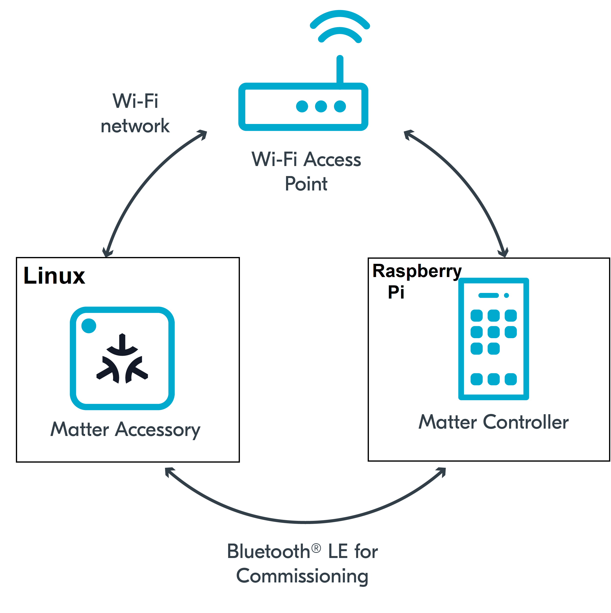

summary: How to Install Matter on RPi
id: how-to-install-matter-on-rpi
categories: Sample
tags: medium
status: Published 
authors: MatterCoder
Feedback Link: https://mattercoder.com

# How to Install Matter on RPi
<!-- ------------------------ -->
## Overview 
Duration: 25

In this codelab we will show you how to build and install the Matter Controller on a Raspberry Pi.

### What You’ll Build 
In this codelab, you will:
- Build the chip-tool as a Matter controller on a Raspberry Pi.
- Learn about the concept of Matter Fabrics

### Architecture


in this CodeLab we will build the Matter Controller on a Raspberry Pi and we use this to controller a Matter Accessory that we set up previously on our Linux Host. This will allow us to create a multi admin Matter Network and we will learn how Matter fabrics work.

### What You’ll Learn 
- What you will need (Pre-requisities)
- How to set up a headless Raspberry Pi
- What prerequisites are required for the Raspberry Pi
- How to build the matter controller on the Raspberry Pi
- What is a Matter fabric and how to control a sample app using the chip-tool

<!-- ------------------------ -->
## What you will need (Pre-requisities)
Duration: 2

This set of Codelabs will use `Ubuntu 22.04` on a Amd64 based architecture. If you are using Mac OS then you should follow the instructions directly from the [Matter repo](https://github.com/project-chip/connectedhomeip/blob/master/docs/guides/BUILDING.md)

You will need
- a Raspberry Pi 4 (or Raspberry Pi 3)
- a SD card at least 16GB to install Ubuntu 22.04 OS
- a laptop or PC running `Ubuntu 22.04` 
- Visual Studio Code IDE
- a basic knowledge of Linux shell commands

The total codelab will take approximately a `Duration of 30 minuates` to complete. 

<!-- ------------------------ -->
## How to set up a headless Raspberry Pi
Duration: 5

We will be using the RPImager tool which is available on the [Raspberry Pi Software Page](https://www.raspberrypi.com/software/)


1. First thing we will do is insert your SD card into the SD card reader on your laptop

2. Next we will do is select the Ubuntu OS version 22.04 64bit (server edition)


3. Then select the `settings cog` to open the advanced settings


You can use whatever settings to meet your requirements, however, you will need to remember the hostname so please write this down
and make sure its unique on your network.

Also, in future codelabs we will be making us of the user account that you create so I recommend that you set 
- the hostane name to `mattercontroller.local`
- the account name to `ggc_user`. 

You can use whatever password matches your security needs.

Enter your wifi network credentials. These should be for the same wifi network that you Linux host that you set up in a previous codelab that is running the Matter Sample app. 

2. Flash the SD card, Insert and Power up

After the SD card has been written, transfer it to your Raspberry Pi and power up your Pi

3. Try to discover and log into your RPi

You should be able to discover your RPi using its hostname 

```shell
ssh ggc_user@mattercontroller.local
```

If, like me, you are using Windows Subsystem for Linux or for some reason your router is blocking mDNS broadcast you can find the IP address of
your RPi using nmap on your local network ip subnet `sudo nmap -p 22 192.168.0.0/24`

```shell
ssh ggc_user@IPADDRESSHERE
```

4. Always good practice to upgrade to latest release:

```shell
sudo apt-get update
sudo apt-get upgrade
```

<!-- ------------------------ -->
## How to Add Swap Space on Ubuntu 22.04 (optional for RPi 3)
Duration: 5

If you are using a Raspberry Pi 3 (RPI 4s are hard to come by!) then you may want to add some swap space as 
the code compilation required to build the matter library may push the RPI3 to its limits. The RPI 3 is limited
in RAM space so having some Swap space may help prevent the dreaded hanging!

1. Create Swap file
```shell
sudo fallocate -l 500M /swapfile1
```

2. Verify Swap file allocated space
```shell
ls -lh /swapfile1
```

3. Change Swap file permission

```shell
sudo chmod 600 /swapfile1
```

4. Mark swapfile1 as swap space

```shell
sudo mkswap /swapfile1
```

5. Enable Swap file
```shell
sudo swapon /swapfile1
```

6. Check swap file availability
```shell
sudo swapon --show
free -h
```

7. Make Swap file permanent
```shell
sudo cp /etc/fstab /etc/fstab.bak
echo '/swapfile1 none swap sw 0 0' | sudo tee -a /etc/fstab
```

<!-- ------------------------ -->
## What prerequisites are required for the Raspberry Pi
Duration: 2

The official matter github repo is the [ConnectedHomeIP repo from Project Chip](https://github.com/project-chip/connectedhomeip)

1. First thing we will do is create a new folder so that we can clone the code

```shell
mkdir ~/Projects
cd ~/Projects
```

2. Next we will clone the github repo

```shell
git clone https://github.com/project-chip/connectedhomeip.git
cd connectedhomeip
#git checkout tags/v1.1.0.1 #We try to keep to main tags (see releases)
```

3. Matter relies on a substantial number of submodules. So next we will synchronize these submodules

```shell
./scripts/checkout_submodules.py --allow-changing-global-git-config --shallow --platform linux
```

Note: this process can take a while the very 1st time you install matter.

Before building our Matter controller and sample app, we need to install a few OS specific dependencies.

4. Since we are using Ubuntu 22.04, the following dependencies are needed:

```shell
sudo apt-get install git gcc g++ pkg-config libssl-dev libdbus-1-dev \
     libglib2.0-dev libavahi-client-dev ninja-build python3-venv python3-dev \
     python3-pip unzip libgirepository1.0-dev libcairo2-dev libreadline-dev 
```

Note: this process can take a while the very 1st time when you install matter.


5. Additionally for the Raspberry Pi, the following dependencies are needed:

```shell
sudo apt-get install pi-bluetooth avahi-utils 
```

6. Do a little clean up to save disk space.

```shell
sudo apt-get clean
```

7. The Connectedhomeip repo requires the ZAP tool for code generation. Unfortunately there are no compatible executables for ARM64 yet and
the process of installing the ZAP tool is very complex and requires a lot of disk space. Therefore, I have pregenerated the required code
and made it available on my Repo. Execute this commands to get the pregenerated code. Hopefully in the future this process will be easier.

```shell
wget https://github.com/oidebrett/mattercloudcontroller/raw/main/integrations/docker/zzz_pregenerated.zip
unzip zzz_pregenerated.zip
rm zzz_pregenerated.zip
```


### Configuring wpa_supplicant for storing permanent changes
By default, wpa_supplicant is not allowed to update (overwrite) configuration. If you want the Matter application to be able to store the configuration changes permanently, you need to make the following changes:

Edit the dbus-fi.w1.wpa_supplicant1.service file to use configuration file instead by running the following command:

```shell
sudo nano /etc/systemd/system/dbus-fi.w1.wpa_supplicant1.service
```
Run the following command to change the wpa_supplicant start parameters to the provided values:

`ExecStart=/sbin/wpa_supplicant -u -s -i wlan0 -c /etc/wpa_supplicant/wpa_supplicant.conf`

Add the wpa-supplicant configuration file by running the following command:

```shell
sudo nano /etc/wpa_supplicant/wpa_supplicant.conf
```
Add the following content to the wpa-supplicant file:

`ctrl_interface=DIR=/run/wpa_supplicant`
`update_config=1`

Finally, reboot your Raspberry Pi and log back in again.

## How to build the matter controller on the Raspberry Pi (chip-tool)
Before building any matter app or controller we will need to create and initialise the environment

Run the following commands
```shell
cd ~/Projects/connectedhomeip
source scripts/activate.sh
```

If everything has gone ok with the environment setup you should see:

```shell
Checking the environment:

20230506 13:25:40 INF Environment passes all checks!

Environment looks good, you are ready to go!
```

2. We then need to build the chip tool. Run the following commands

```shell
gn gen out/chiptool_arm64_release --args='chip_mdns="platform" chip_inet_config_enable_ipv4=false chip_code_pre_generated_directory="../../../zzz_pregenerated/" chip_detail_logging=false symbol_level=0'

ninja -C out/chiptool_arm64_release chip-tool
```
Note: if using a Raspberry Pi 3 you can use the flag -j 1 in the ninja command to limit multi tasking the build across multiple cores. This
can help prevent hangs.

3. We then move the Matter Controller (chip-tool) to the `out` directory using the following commands

```shell
mv out/chiptool_arm64_release/chip-tool out/chip-tool \
&& rm -rf out/chiptool_arm64_release
```

4. If everything worked OK you should see an executable called `chip-tool`in the `out/` directory

```shell
cd out/
ls -al
```

Note: if you run the `chip-tool` ensure that you clean up some of the temporary files using `rm -rf /tmp/chip*` as its a good habit to remove these after every time you test.

<!-- ------------------------ -->
## Basic testing with ESP32 sample app and chip-tool
Duration: 10

In this section we will run a sample matter accessory application (all-clusters-app) and control with an administrative
tool called the chip-tool that acts as a matter controller.

### Running the CHIP Tool
Firstly we will check if the CHIP Tool runs correctly. Execute the following command in the connectedhomeip directory:

```shell
./out/chip-tool
```

As a result, the CHIP Tool will print all available commands. These are called clusters in this context, but not all listed commands correspond to the clusters in the Data Model (for example, pairing or discover commands).

### Using the CHIP Tool
1. Clean the initialization of state using the following command:
```shell
rm -fr /tmp/chip_*
```
Note: removing the /tmp/chip* files can sometimes clear up unexpected behaviours.

3. In the same shell window, try to commission the matter accessory using the the CHIP Tool. Commissioning is what we call the 
process of bringing a Matter Node into a Matter Fabric. We will explain all of these terms in a further codelab. Essentially,
we are creating a secure relationship between the Matter Controller (chip-tool) and the Matter Accessory (chip-all-clusters-app).

```shell
./out/chip-tool pairing ble-wifi ${NODE_ID_TO_ASSIGN} ${SSID} ${PASSWORD} 20202021 3840
```

If everything is working you should see output logs and you should see that the commissioning was successful

```shell
[1683309736.149316][15:17] CHIP:CTL: Successfully finished commissioning step 'Cleanup'
[1683309736.149405][15:17] CHIP:TOO: Device commissioning completed with success
```

4. Now that we have created a secure relationship by "commissioning" the matter accessory we will now do some simple 
interaction with the Matter Accessory using the chip-tool as a Matter controller. We will get into further details 
of the "interaction model" and "data model" of Matter in later codelabs. But for now, we will do some simple 
interactions/

In the same shell window, we will read the vendor-name of the Matter accessory using the following command:

```shell
./out/chip-tool basicinformation read vendor-name 1 0
```

In the output logs, you should see that the Vendor Name

```shell
[1682445848.220725][5128:5130] CHIP:TOO:   VendorName: TEST_VENDOR
```

6. We can read other information using these commands:
```shell
./out/chip-tool basicinformation read product-name 1 0
./out/chip-tool basicinformation read software-version 1 0
```

We are using the Basic Information `cluster`. Clusters are logical groupings of Matter functionality.

7. We can read other information from another using these commands:
```shell
./out/chip-tool generaldiagnostics read up-time 1 0
```

In the output logs, you should see the UpTime

```shell
[1682446010.495854][5286:5288] CHIP:TOO:   UpTime: 1008
```

8. You can find out the other different clusters that are supported by the chip-tool by running:
```shell
./out/chip-tool 
```

### Cleaning Up
You should stop the chip-all-clusters-app process by using Ctrl-C in the first shell window.

It also a great habit to clean up the temporary files after you finish testing by using this command:
```shell
rm -fr /tmp/chip_*
```
Note: removing the /tmp/chip* files can sometimes clear up unexpected behaviours.


<!-- ------------------------ -->
## Further Information
Duration: 1

Checkout the official documentation here: [Project Chip - ConnectedHomeIp](https://github.com/project-chip/connectedhomeip/tree/master/docs)

