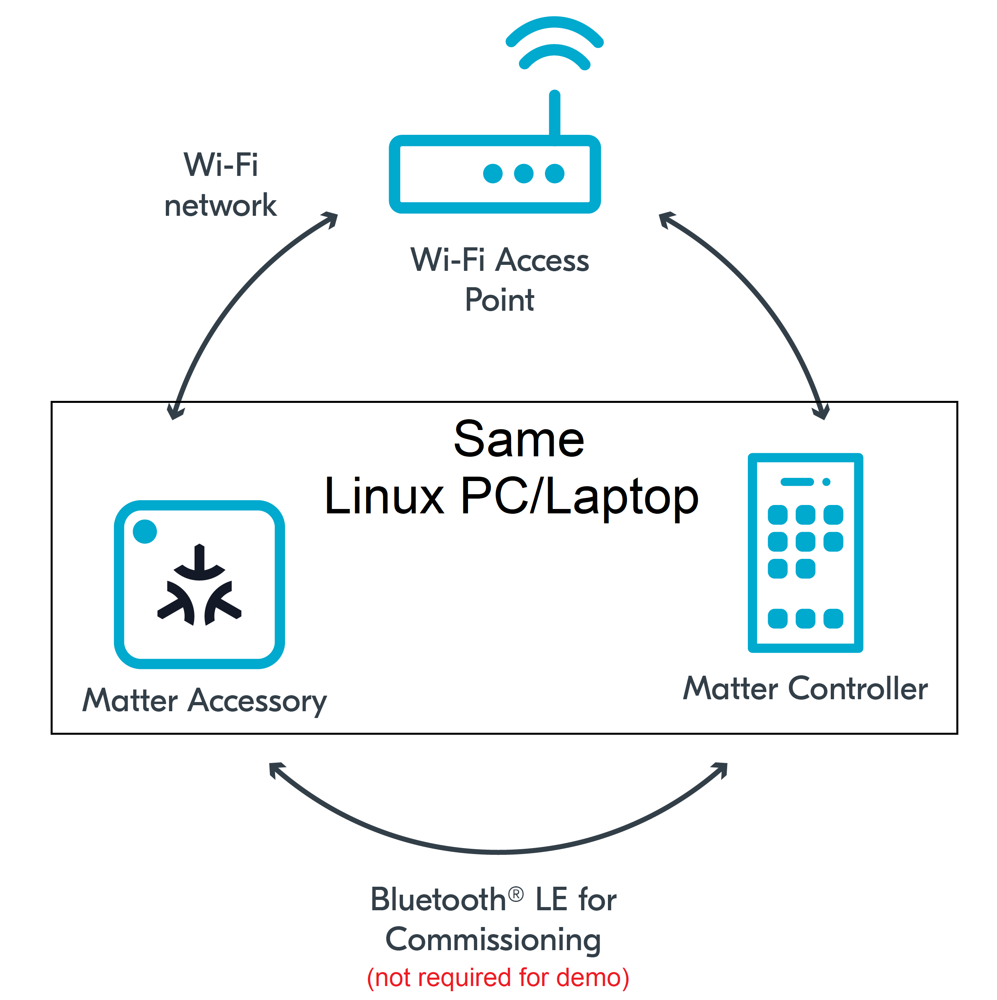

summary: How to Install Matter
id: how-to-install-matter
categories: Setup
tags: medium
status: Published 
authors: MatterCoder
Feedback Link: https://mattercoder.com

# How to Install Matter
<!-- ------------------------ -->
## Overview 
Duration: 100

In this codelab we will show you how to build and install a Matter controller and sample app on a Linux based OS.

### What You’ll Build 
In this codelab, you will:
- Build a sample Matter Application that supports much of the standard matter capabilities (clusters) of a Matter Accessory
- Build a management tool that will act as a Matter controller.

### Architecture


Typically a Matter Access will not be connected to the same Wifi or Thread network as the Matter Controller and a process of "commissioning" over Bluetooth Low Energy will take place. However,
in this CodeLab we will run the Matter Accessory and the Matter Controller on the same Linux Host.
This will allow us to create a simple Matter Network very quickly. In further codelabs, we will
learn how to commission over BLE.


### What You’ll Learn 
- What you will need (Pre-requisities)
- Where to get the latest version of Matter 
- How to install prerequisites on Linux 
- What is and how to install the ZAP tool
- How to build a sample matter app and the matter controller (chip-tool)
- Basic testing with sample app and chip-tool

<!-- ------------------------ -->
## What you will need (Pre-requisities)
Duration: 10

This set of Codelabs will use `Ubuntu 22.04` on a Amd64 based architecture. If you are using Mac OS then you should follow the instructions directly from the [Matter repo](https://github.com/project-chip/connectedhomeip/blob/master/docs/guides/BUILDING.md)

You will need
- a laptop or PC running `Ubuntu 22.04` with a Bluetooth interface
- Visual Studio Code IDE
- some knowledge of Linux commands

The total codelab will take approximately a `Duration of 30 minuates` to complete. 

<!-- ------------------------ -->
## Where to get the latest version of Matter 
Duration: 5

The official matter github repo is the [ConnectedHomeIP repo from Project Chip](https://github.com/project-chip/connectedhomeip)

1. First thing we will do is create a new folder so that we can clone the code

```shell
mkdir ~/Projects
cd ~/Projects
```

2. Next we will clone the github repo

```shell
git clone https://github.com/project-chip/connectedhomeip.git
cd connectedhomeip
```

3. Matter relies on a substantial number of submodules. So next we will synchronize these submodules

```shell
#git submodule update --init
./scripts/checkout_submodules.py --shallow --platform linux
```

Note: this process can take a while the very 1st time you install matter.

<!-- ------------------------ -->
## How to install prerequisites on Linux 
Duration: 5

Before building our Matter controller and sample app, we need to install a few OS specific dependencies.

1. If using Ubuntu 22.04, the following dependencies are needed:

```shell
sudo apt-get install git gcc g++ pkg-config libssl-dev libdbus-1-dev \
     libglib2.0-dev libavahi-client-dev ninja-build python3-venv python3-dev \
     python3-pip unzip libgirepository1.0-dev libcairo2-dev libreadline-dev
```

Note: this process can take a while the very 1st time when you install matter.

<!-- ------------------------ -->
## What is and how to install the ZAP tool 
Duration: 5

When working with Matter you will need to use the ZAP tool. The ZAP tool is an open source 
tool provided by Project-CHIP. The ZAP tool is a tool that is used to help in the generation 
of code for each Matter application. Meta data associated with each matter application, such
as clusers and attributes that are supported, can be defined in Zap files. These Zap files 
are then transposed to the specific code for the underlying system architectures.

Before building our Matter sample apps, we need to install the ZAP tool.

1. Download the latest ZAP version to the latest version. At the time of writing its v2023.04.21-nightly

```shell
cd ~/Projects
mkdir zap-linux
cd zap-linux
export ZAP_VERSION=v2023.04.21-nightly
wget https://github.com/project-chip/zap/releases/download/${ZAP_VERSION}/zap-linux.zip
```

Note: please check the latest version of the Zap tool on the [Releases page from the Project Chip Zap repo](https://github.com/project-chip/zap/releases)

2. Unzip the zap-cli tool 

```shell
unzip zap-linux.zip && rm zap-linux.zip
```

3. Confirm that the zap-cli tool is installed and working

```shell
./zap-cli
```

if working correctly you should see something like the following:
```javascript
🔧 Using state directory: /home/____________/.zap
{
  url: 'http://localhost:9070',
  version: '2023.4.21',
  featureLevel: 96,
  hash: '01XXXXXXXX1XXXXXXXXXXXXXXXXXXXXXXXXXXXXXXXXXXXXXXX4',
  timestamp: 1682083603,
  date: '2023-04-21T13:26:43.000Z',
  exe: './zap-cli'
}
-- JSON START --
{"url":"http://localhost:9070","version":"2023.4.21","featureLevel":96,"hash":"01XXXXXXXX1XXXXXXXXXXXXXXXXXXXXXXXXXXXXXXXXXXXXXXX4","timestamp":1682083603,"date":"2023-04-21T13:26:43.000Z","exe":"./zap-cli"}
-- JSON END --
```

hit Ctrl-C to exit the tool.

4. Finally, add the zap-cli path to your path environment variable

```shell
export PATH=$PATH:$(pwd)
```

Note: you should add ~/Projects/zap-linux to your path in your .bashrc file if you want to permanently 
have the zap-cli tool in your path.

4. Lastly, check that the zap-cli path is working

```shell
cd ~/Projects/connectedhomeip
zap-cli
```

<!-- ------------------------ -->
## How to build a sample matter app and the matter controller (chip-tool)
Duration: 10

In this section we will build a sample matter app that we can use for testing and 
experiementing. We will use the `Linux all-clusters-app` which has all the main
capabilities of a matter end device. 

We will also build the matter controller tool that is provided by Project-Chip.
The chip-tool is an example application that uses Matter to send messages to a Matter server.
It is very useful for experimenting with Matter devices and can help us understand how Matter works.

1. Before building any matter app or controller we will need to create and initialise
the environment

Run the following commands
```shell
cd ~/Projects/connectedhomeip
source scripts/activate.sh
```

If everything has gone ok with the environment setup you should see:

```shell
Checking the environment:

20230423 16:49:39 INF Environment passes all checks!

Environment looks good, you are ready to go!
```

2. We then need to build the underlying core chip libraries

Run the following commands
```shell
gn gen out/debug --args='chip_mdns="platform" chip_inet_config_enable_ipv4=false'
ninja -C out/debug
```

3. We then can build the required sample apps using the following commands

```shell
./scripts/build/build_examples.py \
  --target linux-x64-all-clusters-ipv6only \
  --target linux-x64-chip-tool-ipv6only \
  build \
  && mv out/linux-x64-all-clusters-ipv6only/chip-all-clusters-app out/chip-all-clusters-app \
  && mv out/linux-x64-chip-tool-ipv6only/chip-tool out/chip-tool 
```

4. If everything worked OK you should see an executable called `chip-all-clusters-app` and `chip-tool`in the `out/` directory

```shell
cd out/
ls -al
```

Note: if you run the `chip-all-clusters-app` ensure that you clean up some of the temporary files  using `rm -rf /tmp/chip*` as its a good habit to remove these after every run.


<!-- ------------------------ -->
## Basic testing with sample app and chip-tool
Duration: 10

### Hyperlinking
[Youtube - Halsey Playlists](https://www.youtube.com/user/iamhalsey/playlists)

### Images


<!-- ------------------------ -->
## Further Information
Duration: 1

Checkout the official documentation here: [Project Chip - ConnectedHomeIp](https://github.com/project-chip/connectedhomeip/tree/master/docs)

