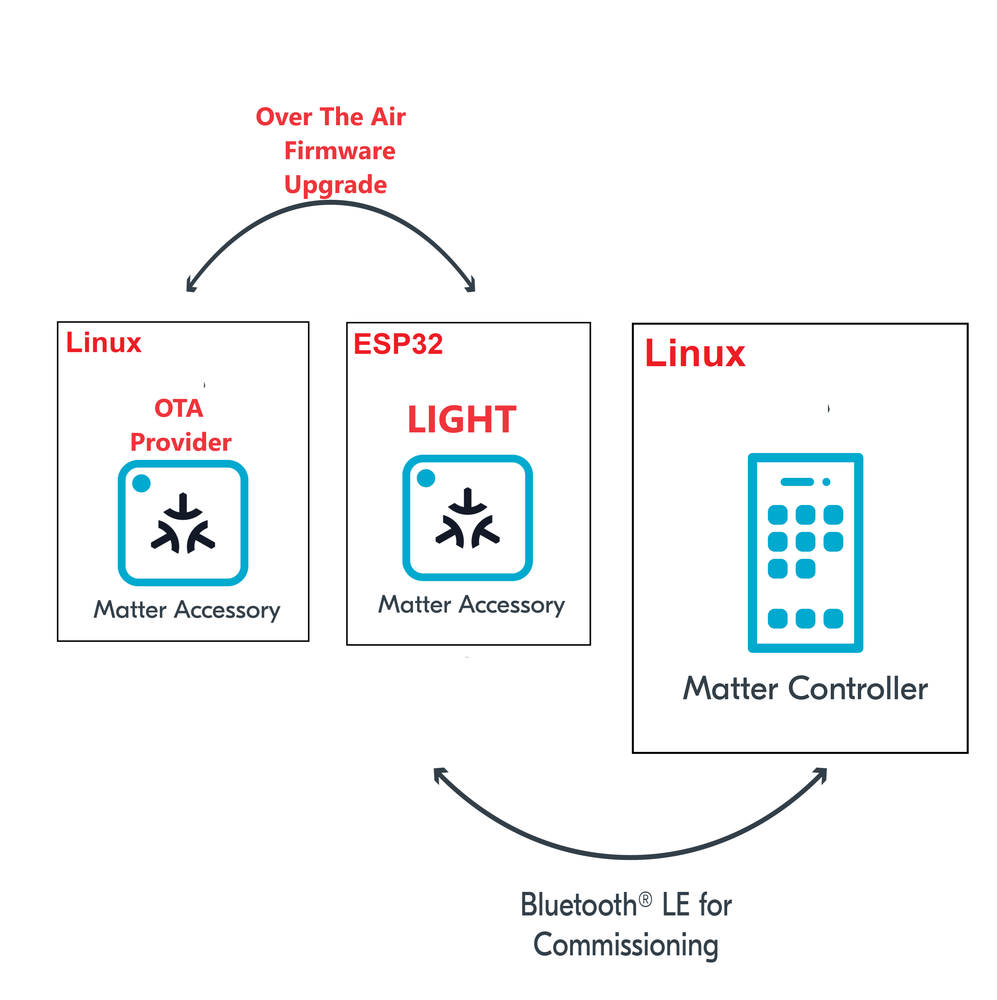

summary: How to provide OTA
id: how-to-provide-ota
categories: Sample
tags: matter
status: Published 
authors: MatterCoder
Feedback Link: https://mattercoder.com

# How to provide OTA
<!-- ------------------------ -->
## Overview 
Duration: 15

In this codelab we will show you how you can provide Over The Air software updates (OTA) for your ESP32 matter app.

### What You’ll Build 
In this codelab, you will:
- Build and run a Matter light from the connectedhomeip repo on an ESP32
- Learn how to change the software version of your application
- Learn how to generate an image that can be used for OTA
- Build and use the ota provider app.
- Use the chip-tool on Linux as a Matter controller to act initiate an Over The Air activation.

### Architecture


In this CodeLab we will run a Matter Latter on a ESP32 microcontroller, the OTA provider on Linux. This will allow us to provide OTA updates and we will learn how to use the OTA feature of the Matter protocol.

Note, we will use the Matter lighting app that we coded in a previous codelab.

### What You’ll Learn 
- What you will need (Pre-requisities)
- How to configure the software version for the Matter light
- How to generate OTA firmware images
- How to build and start the OTA provider
- How to initiate OTA using the chip tool

<!-- ------------------------ -->
## What you will need (Pre-requisities)
Duration: 2

This set of Codelabs will use `Ubuntu 22.04` on a Amd64 based architecture.

You will need
- a ESP32 microcontroller. ESP32 DEV KIT C
- a laptop or PC running `Ubuntu 22.04` with a Bluetooth interface
- an android phone running the chip-tool
- Visual Studio Code IDE
- a basic knowledge of Linux shell commands

The total codelab will take approximately a `Duration of 30 minuates` to complete. 

<!-- ------------------------ -->
## Flash the Matter Light to an ESP32 
Duration: 2

We will use the Matter light that we built in 

```shell
~/Projects/starter-esp-matter-app
```

1. The first thing to do is set up the ESP Matter SDK and the ESP-IDF environments (you should do this step everytime you open a new terminal)

```shell
cd esp-idf
source ./export.sh
cd ..
cd esp-matter
source ./export.sh
```

2. We will navigate to the Matter Light that you had previously coded.

```shell
cd ~/Projects/starter-esp-matter-app
```

3. You will then build and flash the Matter light image on to the ESP32. But its good practice to erase the flash before hand.

```shell
idf.py build
idf.py -p /dev/ttyUSB0 erase_flash
idf.py -p /dev/ttyUSB0 flash monitor 
```

** replace the path with your device path


<!-- ------------------------ -->
## Pairing using the chip-tool and read software version
Duration: 10

In this section we will run a ESP32 matter light application (light switch app) and control with an administrative
tool called the chip-tool that acts as a matter controller. We will read the current software version.

### Pairing using the CHIP Tool
1. Clean the initialization of state using the following command:
```shell
rm -fr /tmp/chip_*
```
Note: removing the /tmp/chip* files can sometimes clear up unexpected behaviours.

2. In the same shell window, try to commission the matter accessory using the the CHIP Tool. Commissioning is what we call the  process of bringing a Matter Node into a Matter Fabric. We will explain all of these terms in a further codelab. Essentially, we are creating a secure relationship between the Matter Controller (chip-tool) and the Matter Accessory (light switch app).

```shell
./out/host/chip-tool pairing ble-wifi ${NODE_ID_TO_ASSIGN} ${SSID} ${PASSWORD} 20202021 3840
```

If everything is working you should see output logs and you should see that the commissioning was successful

```shell
[1683309736.149316][15:17] CHIP:CTL: Successfully finished commissioning step 'Cleanup'
[1683309736.149405][15:17] CHIP:TOO: Device commissioning completed with success
```

3. Now that we have created a secure relationship by "commissioning" the matter accessory we will now do some simple interaction with the Matter Accessory using the chip-tool as a Matter controller. 

In the same shell window, we will read the software-version of the Matter accessory using the following command:

```shell
./out/host/chip-tool basicinformation read software-version 1 0
```

In the output logs, you should see that the Vendor Name

```shell
[1682445848.220725][5128:5130] CHIP:TOO:   SoftwareVersion: 1
```


<!-- ------------------------ -->
## Update Software Version and Generate OTA image
Duration: 10

1. Change the CONFIG_APP_PROJECT_VER_FROM_CONFIG option in the file ~/Projects/esp-matter/connectedhomeip/connectedhomeip/examples/lighting-app/esp32/sdkconfig

from 

```shell
# CONFIG_APP_PROJECT_VER_FROM_CONFIG is not set
```

to

```shell
CONFIG_APP_PROJECT_VER_FROM_CONFIG=y
```

2. Set the Software Version
With the CONFIG_APP_PROJECT_VER_FROM_CONFIG option enabled, you need to set the version using the following configuration options to set the Software Version:

```shell
idf.py menuconfig 
```

Set the CONFIG_DEVICE_SOFTWARE_VERSION_NUMBER option. (Component config -> CHIP Device Layer -> Device Identification Options -> Device Software Version Number)

Software Version String
Set the CONFIG_APP_PROJECT_VER option. (Application manager -> Get the project version from Kconfig)

Ensure to increment that software version number i.e. 2

3. Enable the CONFIG_ENABLE_OTA_REQUESTOR option to enable Matter OTA Requestor function

(Component config -> CHIP Core -> Enable OTA requestor)

4. Configure Matter OTA image generation

(Component config -> CHIP Device Layer -> Matter OTA image)

```shell
idf.py menuconfig
```

5. Make sure to set the CONFIG_APP_PROJECT_VER to "2" in sdkconfig

```shell
CONFIG_APP_PROJECT_VER="2"
```

6. Set the PROJECT_VER and PROJECT_VER_NUMBER in CMakeLists.txt to align with the new version.

```shell
set(PROJECT_VER "2.0")
set(PROJECT_VER_NUMBER 2)
```

7. Build the latest version and flash the Matter light image on to the ESP32 as this image now has the OTA requestor. We do not need to erase the flash before hand as we want to remain paired.

```shell
idf.py build
idf.py -p /dev/ttyUSB0 flash monitor 
```

Confirm the software version number using the chip tool

```shell
./out/host/chip-tool basicinformation read software-version 1 0
```

In the output logs, you should see that the Vendor Name

```shell
[1682445848.220725][5128:5130] CHIP:TOO:   SoftwareVersion: 2
```

9. Set the Software Version to version 3

Use the steps above to set the version to 3. Build but DO NOT flash. We will use OTA for loading this onto the ESP32.

```shell
idf.py build
```

Confirm that the ota image is produced in the build folder such as "build/light-ota.bin"

10. Monitor the ESP32 (but DO NOT flash)

```shell
idf.py -p /dev/ttyUSB0 monitor 
```

<!-- ------------------------ -->
## Build and pair the OTA providers
Duration: 10

1. Open a new terminal and build the OTA provider example app in connectedhomeip

```shell
cd  ~/Projects/esp-matter/connectedhomeip/connectedhomeip/
source scripts/activate.sh 
scripts/build/build_examples.py \
    --target linux-x64-ota-provider-ipv6only \
    build \
    && mv out/linux-x64-ota-provider-ipv6only/chip-ota-provider-app out/host/chip-ota-provider-app \
    && rm -rf out/linux-x64-ota-provider-ipv6only
```


2. Run the OTA provider app and point it to the ota image you created in the last step.

```shell
./out/host/chip-ota-provider-app --filepath ~/Projects/starter-esp-matter-app/build/light-ota.bin 
```

3. Commission / Pair the OTA provider onto the Matter fabric - note it has node id 2

```shell
./out/host/chip-tool pairing onnetwork-long 2 20202021 3840
```


<!-- ------------------------ -->
## Initiate the Over The Air Upgrade
Duration: 10

### Announce the OTAProvider

1. Issue the AnnounceOTAProvider command

```shell
./out/host/chip-tool otasoftwareupdaterequestor announce-otaprovider 2 0 0 0 1 0
```

The OTA Requestor application with node ID 1 will process this command and send a QueryImage command to the OTA Provider with node ID 2, as specified in the AnnounceOTAProvider command.

2. Notice the Access Denied on the OTA provider

```shell
[1707424999.215964][142792:142792] CHIP:DMG: AccessControl: checking f=1 a=c s=0x0000000000000001 t= c=0x0000_0029 e=0 p=o
[1707424999.216085][142792:142792] CHIP:DMG: AccessControl: denied
```

3. Install necessary ACL entries. write the ACL attribute with two entries:

```shell
./out/host/chip-tool accesscontrol write acl '[{"fabricIndex": 1, "privilege": 5, "authMode": 2, "subjects": [112233], "targets": null}, {"fabricIndex": 1, "privilege": 3, "authMode": 2, "subjects": null, "targets": [{"cluster": 41, "endpoint": null, "deviceType": null}]}]' 2 0
```

Entry 1: This is the original entry created as part of commissioning which grants administer privilege to the node ID 112233 (default controller node ID) for all clusters on every endpoint
Entry 2: This is the new entry being added which grants operate privileges to all nodes for the OTA Provider cluster (0x0029) on every endpoint

In the example above, the provider is on fabric index 1 with provider node ID being 2 


4. Issue the AnnounceOTAProvider command again

```shell
./out/host/chip-tool otasoftwareupdaterequestor announce-otaprovider 2 0 0 0 1 0
```

5. View the Over The Air Activation 

The OTA should start. Wait for the process to finish. It could take some time!

6. Confirm the new software version

In the same shell window, we will read the software-version of the Matter accessory using the following command:

```shell
./out/host/chip-tool basicinformation read software-version 1 0
```

In the output logs, you should see that the updated Software Version

```shell
[1682445848.220725][5128:5130] CHIP:TOO:   SoftwareVersion: 3
```


### Cleaning Up
You should stop the switch-app process by using Ctrl-] in the first esp32 monitor window, the light-app process by using Ctrl-] in 
the second esp32 monitor window and then run idf erase flash.

It also a great habit to clean up the temporary files after you finish testing by using this command:
```shell
rm -fr /tmp/chip_*
```
Note: removing the /tmp/chip* files can sometimes clear up unexpected behaviours.


<!-- ------------------------ -->
## Further Information
Duration: 1

Checkout the official documentation [Espressif Matter SDK documentation here: ] (https://docs.espressif.com/projects/esp-matter/en/latest/esp32/)

Also check out the Project CHIP Matter SDK repo [Project Chip - ConnectedHomeIp](https://github.com/project-chip/connectedhomeip/tree/master/docs)

