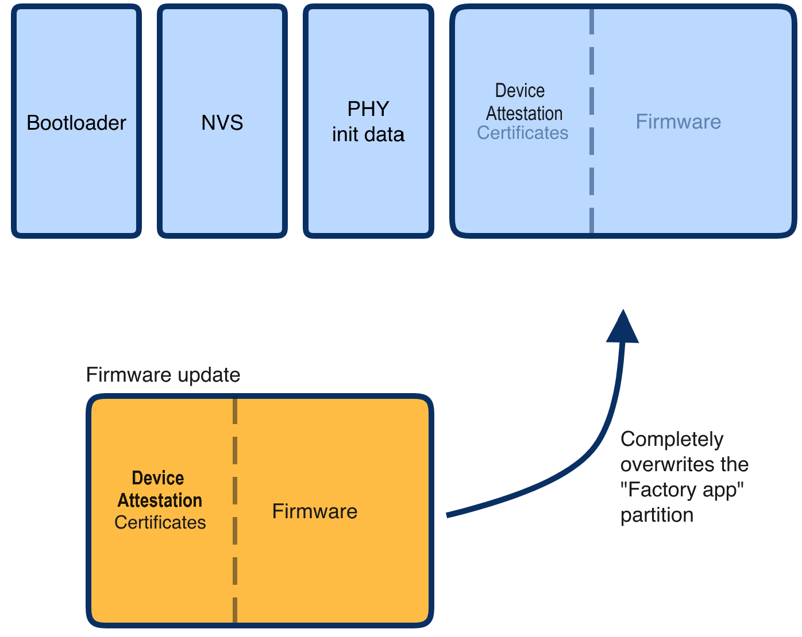

summary: How to secure Matter certs
id: how-to-secure-matter-certs
categories: Sample
tags: matter
status: Published 
authors: MatterCoder
Feedback Link: https://mattercoder.com

# How to Secure Matter Certs
<!-- ------------------------ -->
## Overview 
Duration: 15

In this codelab we will show you how you can secure your matter apps

### What You’ll Build 
In this codelab, you will:
- Learn about the PKI that is used in Matter
- Learn how to generate new Device Attestation Certificates
- Learn how to hard code DACs in to your matter apps
- Learn how to securely flash DACs in to your matter apps.
- Use the chip-tool on Linux as a Matter controller to control your matter apps.

### Architecture


In this CodeLab we will generate new Device Attestation Certificates and use these on our Matter applications.

Note, we will use the Matter lighting app that we coded in a previous codelab.

### What You’ll Learn 
- What you will need (Pre-requisities)
- How Digital Attestation Certificates are created
- How to hard code DACs in to the Matter light
- How to use secure partitions for more secure loading of DACs

<!-- ------------------------ -->
## What you will need (Pre-requisities)
Duration: 2

This set of Codelabs will use `Ubuntu 22.04` on a Amd64 based architecture.

You will need
- a ESP32 microcontroller. ESP32 DEV KIT C
- a laptop or PC running `Ubuntu 22.04` with a Bluetooth interface
- Visual Studio Code IDE
- a basic knowledge of Linux shell commands

The total codelab will take approximately a `Duration of 30 minuates` to complete. 

<!-- ------------------------ -->
## Create new Certificates for ESP32 matter lighting app example
Duration: 2

We will use the Matter light that we built in 

```shell
~/Projects/starter-esp-matter-app
```

### Create the Certificate Declaration

1. The first thing to do is Export your custom VID/PID as environment variables to decrease chances of clerical error when editing your command arguments:

export VID=hexVendorId
export PID=hexProductId

```shell
export VID=FFAA
export PID=FFA1

echo ${VID} 
echo ${PID} 
```

2. Generate the CD using chip-cert. Currently the Commissioner only validates that the VID and PID match the data exposed elsewhere by the device: the Basic Information Cluster, DAC and DAC origin (when it has it). You may leave the other fields unchanged:


```shell
cd ~/Projects/esp-matter/connectedhomeip/connectedhomeip/
./out/host/chip-cert gen-cd \
  --key credentials/test/certification-declaration/Chip-Test-CD-Signing-Key.pem \
  --cert credentials/test/certification-declaration/Chip-Test-CD-Signing-Cert.pem \
  --out credentials/test/certification-declaration/Chip-Test-CD-${VID}-${PID}.der \
  --format-version "1" \
  --vendor-id "${VID}" \
  --product-id "${PID}" \
  --device-type-id "0x1234" \
  --certificate-id "ZIG20141ZB330001-24" \
  --security-level "0" \
  --security-info "0" \
  --version-number "9876" \
  --certification-type "0"
```

Look in the credentials/test/certification-declaration directory. 

3. Verify the CD. Make sure it contains your VID/PID (in decimal format):

```shell
./out/host/chip-cert print-cd credentials/test/certification-declaration/Chip-Test-CD-${VID}-${PID}.der
```

### Generate a PAI and DAC

In this example we'll use Matter's own test Product Attestation Authority (PAA) certificate and signing key Chip-Test-PAA-NoVID as our root certificate. We'll use it as the root CA to generate our own PAI and DAC.

4. Generate the PAI

```shell
./out/host/chip-cert gen-att-cert --type i \
  --subject-cn "Matter Test PAI" \
  --subject-vid "${VID}" \
  --valid-from "2024-01-01 14:23:43" \
  --lifetime "4294967295" \
  --ca-key credentials/test/attestation/Chip-Test-PAA-NoVID-Key.pem \
  --ca-cert credentials/test/attestation/Chip-Test-PAA-NoVID-Cert.pem \
  --out-key credentials/test/attestation/"test-PAI-${VID}-key".pem \
  --out credentials/test/attestation/"test-PAI-${VID}-cert".pem
```

5. Generate the DAC using the PAI:

```shell
./out/host/chip-cert gen-att-cert --type d \
  --subject-cn "Matter Test DAC 0" \
  --subject-vid "${VID}" \
  --subject-pid "${PID}" \
  --valid-from "2024-01-01 14:23:43" \
  --lifetime "4294967295" \
  --ca-key credentials/test/attestation/"test-PAI-${VID}-key".pem \
  --ca-cert credentials/test/attestation/"test-PAI-${VID}-cert".pem \
  --out-key credentials/test/attestation/"test-DAC-${VID}-${PID}-key".pem \
  --out credentials/test/attestation/"test-DAC-${VID}-${PID}-cert".pem
```

6. Verify the DAC, PAI and PAA chain. If no errors appear in the output, it means that the certificate attestation chain is successfully verified:

```shell
./out/host/chip-cert validate-att-cert \
--dac credentials/test/attestation/"test-DAC-${VID}-${PID}-cert".pem \
--pai credentials/test/attestation/"test-PAI-${VID}-cert".pem \
--paa credentials/test/attestation/Chip-Test-PAA-NoVID-Cert.pem
```

7. Inspect your keys using openssl:

```shell
openssl ec -noout -text -in \
  credentials/test/attestation/test-DAC-${VID}-${PID}-key.pem
```

The output should look something like this:

```shell
read EC key
Private-Key: (256 bit)
priv:
    c9:f2:b3:04:b2:db:0d:6f:cd:c6:be:f3:7b:76:8d:
    8c:01:4e:0b:9e:ce:3e:72:49:3c:0e:35:63:7c:6c:
    6c:d6
pub:
    04:4f:93:ba:3b:bf:63:90:73:98:76:1e:af:87:79:
    11:e6:77:e8:e2:df:a7:49:f1:7c:ac:a8:a6:91:76:
    08:5b:39:ce:6c:72:db:6d:9a:92:b3:ba:05:b0:e8:
    31:a0:bf:36:50:2b:5c:72:55:7f:11:c8:01:ff:3a:
    46:b9:19:60:28
ASN1 OID: prime256v1
NIST CURVE: P-256
```

8. You may also use openssl to inspect your generated certificates:

```shell
 openssl x509 -noout -text -in \
  credentials/test/attestation/test-DAC-${VID}-${PID}-cert.pem
```

The output should look something like this:

```shell
Certificate:
    Data:
        Version: 3 (0x2)
        Serial Number: 2875998130766646679 (0x27e9990fef088d97)
        Signature Algorithm: ecdsa-with-SHA256
        Issuer: CN = Matter Test PAI, 1.3.6.1.4.1.37244.2.1 = hexVendorId


        Validity
            Not Before: Jun 28 14:23:43 2021 GMT
            Not After : Dec 31 23:59:59 9999 GMT
        Subject: CN = Matter Test DAC 0, 1.3.6.1.4.1.37244.2.1 = hexVendorId

, 1.3.6.1.4.1.37244.2.2 = hexProductId


            Subject Public Key Info:
                Public Key Algorithm: id-ecPublicKey
                    Public-Key: (256 bit)
                    pub:
                        04:4f:93:ba:3b:bf:63:90:73:98:76:1e:af:87:79:
                        11:e6:77:e8:e2:df:a7:49:f1:7c:ac:a8:a6:91:76:
                        08:5b:39:ce:6c:72:db:6d:9a:92:b3:ba:05:b0:e8:
                        31:a0:bf:36:50:2b:5c:72:55:7f:11:c8:01:ff:3a:
                        46:b9:19:60:28
                    ASN1 OID: prime256v1
                    NIST CURVE: P-256
            X509v3 extensions:
                X509v3 Basic Constraints: critical
                    CA:FALSE
                X509v3 Key Usage: critical
                    Digital Signature
                X509v3 Subject Key Identifier:
                    21:0A:CA:B1:B6:5F:17:65:D8:61:19:73:84:1A:9D:52:81:19:C5:39
                X509v3 Authority Key Identifier:
                    37:7F:24:9A:73:41:4B:16:6E:6A:42:6E:F5:E8:89:FB:75:F8:77:BB
        Signature Algorithm: ecdsa-with-SHA256
        Signature Value:
            30:45:02:20:38:8f:c5:0d:3e:90:95:dd:7d:7c:e9:5a:05:19:
            1f:2d:14:08:a3:d7:0e:b5:15:6d:d3:b0:0b:f7:b8:28:4d:bf:
            02:21:00:d4:05:30:43:a6:05:00:0e:b9:99:0d:34:3d:75:fe:
            d3:c1:4e:73:ff:e7:05:64:7a:62:8d:2d:38:8f:fd:4d:ad
```


Note: A similar process could be used for generating a self-signed PAA, but doing so is not necessary.

Instead, what we've done here is to use an existing self-signed development PAA that doesn't include VID information.

For more examples of generating a CD, look at credentials/test/gen-test-cds.sh And for more examples of generating a PAA, PAI, and DAC, see credentials/test/gen-test-attestation-certs.sh 


<!-- ------------------------ -->
## Hard coding the DAC into the Matter Light app
Duration: 10

In this section we will hard code the DAC certs into the Matter Light

### Use a script to generate template code

1.  Save the following script into a file called generate-embeddable-certs.sh

```shell
#!/bin/bash

#
# generate-embeddable-certs.sh script
# —----------------------------------
#
# This script generates self-minted DAC and PAI.
# The output may easily be included in your C++ source code.
#

# Edit this information with your paths and certificates
folder="credentials/test/attestation"
chip_cert_tool="out/host/chip-cert"
cert_file_der="${folder}/test-PAI-${VID}-cert.der"
cert_file_pem="${folder}/test-PAI-${VID}-cert.pem"
key_file_pem="${folder}/test-PAI-${VID}-key.pem"

type="Pai"

printf "namespace chip {\n"
printf "namespace DevelopmentCerts {\n\n"
printf "#if CHIP_DEVICE_CONFIG_DEVICE_VENDOR_ID == 0x${VID} && CHIP_DEVICE_CONFIG_DEVICE_PRODUCT_ID == 0x${PID}\n\n"

printcert() {
  # convert cert to DER
  if [ -f "${cert_file_der}" ]; then
      rm "${cert_file_der}"
  fi
  "${chip_cert_tool}" convert-cert "${cert_file_pem}" "${cert_file_der}" --x509-der

  printf "// ------------------------------------------------------------ \n"
  printf "// ${type} CERTIFICATE ${cert_file_der} \n\n"

  printf "constexpr uint8_t ${type}_Cert_Array[] = {\n"
  less -f "${cert_file_der}" | od -t x1 -An | sed 's/\</0x/g' | sed 's/\>/,/g' | sed 's/^/   /g'
  printf "};\n\n"
  printf "ByteSpan k${type}Cert = ByteSpan(${type}_Cert_Array);\n\n"

  printf "// ${type} PUBLIC KEY FROM ${key_file_pem} \n\n"

  printf "constexpr uint8_t ${type}_PublicKey_Array[] = {\n"
  openssl ec -text -noout -in "${key_file_pem}" 2>/dev/null | sed '/ASN1 OID/d' | sed '/NIST CURVE/d' | sed -n '/pub:/,$p' | sed '/pub:/d' | sed 's/\([0-9a-fA-F][0-9a-fA-F]\)/0x\1/g' | sed 's/:/, /g'
  printf "};\n\n"
  printf "ByteSpan k${type}PublicKey = ByteSpan(${type}_PublicKey_Array);\n\n"

  printf "// ${type} PRIVATE KEY FROM ${key_file_pem} \n\n"

  printf "constexpr uint8_t ${type}_PrivateKey_Array[] = {\n"
  openssl ec -text -noout -in "${key_file_pem}" 2>/dev/null | sed '/read EC key/d' | sed '/Private-Key/d' | sed '/priv:/d' | sed '/pub:/,$d' | sed 's/\([0-9a-fA-F][0-9a-fA-F]\)/0x\1/g' | sed 's/:/, /g'
  printf "};\n\n"
  printf "ByteSpan k${type}PrivateKey = ByteSpan(${type}_PrivateKey_Array);\n\n"
}

# generates PAI
printcert

type="Dac"
cert_file_der="${folder}/test-DAC-${VID}-${PID}-cert.der"
cert_file_pem="${folder}/test-DAC-${VID}-${PID}-cert.pem"
key_file_pem="${folder}/test-DAC-${VID}-${PID}-key.pem"

# generates DAC
printcert

printf "#endif // CHIP_DEVICE_CONFIG_DEVICE_PRODUCT_ID\n"
printf "} // namespace DevelopmentCerts\n"
printf "} // namespace chip\n"
```

```shell
cd  ~/Projects/esp-matter/connectedhomeip/connectedhomeip/src/credentials/examples/
code ExampleDACs.cpp
```

2. Run the script from the connectedhomeip folder
```shell
. ../certs/generate-embeddable-certs.sh 
```

3. Edit the ExampleDACs.cpp file.

```shell
cd  ~/Projects/esp-matter/connectedhomeip/connectedhomeip/src/credentials/examples/
code ExampleDACs.cpp
```

3. Insert the template code into the very end of DeviceAttestationCredentialsProvider::GetProductAttestationIntermediateCert function


4. Replace the CD (certification-declaration)

Extract a text representation of the contents of your CD file using xxd:

```shell
xxd -i credentials/test/certification-declaration/Chip-Test-CD-${VID}-${PID}.der
```

5. Edit the ExampleDACProvider::GetCertificationDeclaration, in src/credentials/examples/DeviceAttestationCredsExample.cpp

```shell
#elif CHIP_DEVICE_CONFIG_DEVICE_VENDOR_ID == 0xFFAA
    const uint8_t kCdForAllExamples[] = {
            0x30, 0x81, 0xe9, 0x06, 0x09, 0x2a, 0x86, 0x48, 0x86, 0xf7, 0x0d, 0x01,
            0x07, 0x02, 0xa0, 0x81, 0xdb, 0x30, 0x81, 0xd8, 0x02, 0x01, 0x03, 0x31,
            0x0d, 0x30, 0x0b, 0x06, 0x09, 0x60, 0x86, 0x48, 0x01, 0x65, 0x03, 0x04,
            0x02, 0x01, 0x30, 0x45, 0x06, 0x09, 0x2a, 0x86, 0x48, 0x86, 0xf7, 0x0d,
            0x01, 0x07, 0x01, 0xa0, 0x38, 0x04, 0x36, 0x15, 0x24, 0x00, 0x01, 0x25,
            0x01, 0xfe, 0xca, 0x36, 0x02, 0x05, 0xce, 0xfa, 0x18, 0x25, 0x03, 0x34,
            0x12, 0x2c, 0x04, 0x13, 0x5a, 0x49, 0x47, 0x32, 0x30, 0x31, 0x34, 0x31,
            0x5a, 0x42, 0x33, 0x33, 0x30, 0x30, 0x30, 0x31, 0x2d, 0x32, 0x34, 0x24,
            0x05, 0x00, 0x24, 0x06, 0x00, 0x25, 0x07, 0x76, 0x98, 0x24, 0x08, 0x00,
            0x18, 0x31, 0x7d, 0x30, 0x7b, 0x02, 0x01, 0x03, 0x80, 0x14, 0x62, 0xfa,
            0x82, 0x33, 0x59, 0xac, 0xfa, 0xa9, 0x96, 0x3e, 0x1c, 0xfa, 0x14, 0x0a,
            0xdd, 0xf5, 0x04, 0xf3, 0x71, 0x60, 0x30, 0x0b, 0x06, 0x09, 0x60, 0x86,
            0x48, 0x01, 0x65, 0x03, 0x04, 0x02, 0x01, 0x30, 0x0a, 0x06, 0x08, 0x2a,
            0x86, 0x48, 0xce, 0x3d, 0x04, 0x03, 0x02, 0x04, 0x47, 0x30, 0x45, 0x02,
            0x20, 0x53, 0x25, 0x03, 0x2c, 0x96, 0x50, 0xb6, 0x64, 0xf4, 0x18, 0xbf,
            0x99, 0x47, 0xf8, 0x9d, 0xe6, 0xeb, 0x43, 0x94, 0xf1, 0xce, 0xb2, 0x61,
            0x00, 0xe0, 0xf9, 0x89, 0xa8, 0x71, 0x82, 0x02, 0x0a, 0x02, 0x21, 0x00,
            0xea, 0x0a, 0x40, 0xab, 0x87, 0xad, 0x7e, 0x25, 0xe1, 0xa1, 0x6c, 0xb1,
            0x12, 0xfa, 0x86, 0xfe, 0xea, 0x8a, 0xaf, 0x4b, 0xc1, 0xf3, 0x6f, 0x09,
            0x85, 0x46, 0x50, 0xb6, 0xd0, 0x55, 0x40, 0xe2
        };
};
#Put this code just before the last else code
#else  /* Fall back to the VID=0xFFF1 CD */
```

If everything is working you should be able to build and flash the new matter light app

### Build and Flash

Now build the example - note best to do a full clean and remove the build directory

```shell
idf.py clean
idf.py fullclean
rm -rf build

idf.py set-target esp32
idf.py menuconfig #set the vendor id to VID and product id to PID
idf.py build
idf.py -p /dev/ttyUSB0 erase-flash
idf.py -p /dev/ttyUSB0 flash monitor
```

Now try to pair the device using the chip-tool

```shell
cd connectedhomeip
rm -rf /tmp/chip*
./out/host/chip-tool pairing ble-wifi 1 <SSID> <PASSWORD> 20202021 3840
```

Check that pairing worked by reading basic information

```shell
./out/host/chip-tool basicinformation read vendor-name 1 0
```

Note: If you run into problems using the chip-tool with BLE on Mac, please follow the directions on the [Matter SDK repo documentation here](https://github.com/project-chip/connectedhomeip/blob/master/docs/guides/darwin.md#using-chip-tool-on-macos-or-chip-tool-on-ios). In particular, you have to have the Bluetooth Central Matter Client Developer mode profile installed. 

<!-- ------------------------ -->
## Generate PKI credentials for ESP32 matter devices in esp_secure_cert partition
Duration: 10

In this section, we will generate PKI credentials for ESP32 matter devices and store them in esp_secure_cert partition

1. Change format for the certificates and key (.pem to .der format). 

Convert DAC key from .pem to .der format.

```shell
openssl ec -in credentials/test/attestation/"test-DAC-${VID}-${PID}-key".pem -out credentials/test/attestation/"test-DAC-${VID}-${PID}-key".der -inform pem -outform der
```

Convert DAC and PAI cert from .pem to .der format

```shell
openssl x509 -in credentials/test/attestation/"test-DAC-${VID}-${PID}-cert".pem -out credentials/test/attestation/"test-DAC-${VID}-${PID}-cert".der -inform pem -outform der
openssl x509 -in credentials/test/attestation/"test-PAI-${VID}-cert".pem -out credentials/test/attestation/"test-PAI-${VID}-cert".der -inform pem -outform der
```


2. Generate and flash the secure partition
The following command generates the secure cert partition and flashes it to the connected device. Additionally, it preserves the generated partition on the host, allowing it to be flashed later if the entire flash is erased.

```shell
configure_esp_secure_cert.py --private-key credentials/test/attestation/"test-DAC-${VID}-${PID}-key".der \
    --device-cert credentials/test/attestation/"test-DAC-${VID}-${PID}-cert".der \
    --ca-cert credentials/test/attestation/"test-PAI-${VID}-cert".der \
    --target_chip esp32 \
    --keep_ds_data_on_host \
    --port /dev/ttyUSB0 \
    --priv_key_algo ECDSA 256
```

You should notice that a new esp_secure_cert_data folder is created with the esp secure cert file.

<!-- ------------------------ -->
## Configure the esp Matter light application to use the secure certificates
Duration: 10

We must now set up the configuration 

1. Edit the sdkconfig file and add the following code:

```shell
# Disable the DS Peripheral support
CONFIG_ESP_SECURE_CERT_DS_PERIPHERAL=n

# Use DAC Provider implementation which reads attestation data from secure cert partition
CONFIG_SEC_CERT_DAC_PROVIDER=y

# Enable some options which reads CD and other basic info from the factory partition
CONFIG_ENABLE_ESP32_FACTORY_DATA_PROVIDER=y
CONFIG_ENABLE_ESP32_DEVICE_INSTANCE_INFO_PROVIDER=y
CONFIG_FACTORY_COMMISSIONABLE_DATA_PROVIDER=y
CONFIG_FACTORY_DEVICE_INSTANCE_INFO_PROVIDER=y
```


2. Run idf.py menuconfig to confirm the settings

```shell
idf.py menuconfig
```

3. Build the applicaton

```shell
idf.py build
```

<!-- ------------------------ -->
## Factory Partition
Duration: 2

We will not set up the Factory partition which contains basic information like VID, PID, etc, and CD.


1. Export the dependent tools path

```shell
cd esp-matter/tools/mfg_tool
export PATH=$PATH:$PWD/../../connectedhomeip/connectedhomeip/out/host
```

Generate the factory partition, please use the APPROPRIATE values for -v (Vendor Id), -p (Product Id), and -cd (Certification Declaration).

```shell
./mfg_tool.py --passcode 89674523 \
              --discriminator 2245 \
              -cd TEST_CD_FFF1_8001.der \
              -v 0xFFF1 --vendor-name Espressif \
              -p 0x8001 --product-name Bulb \
              --hw-ver 1 --hw-ver-str DevKit
```

Few important output lines are mentioned below. Please take a note of onboarding codes, these can be used for commissioning the device.

```shell
[2024-12-02 11:18:12,059] [   INFO] - Generated QR code: MT:-24J06PF150QJ850Y10
[2024-12-02 11:18:12,059] [   INFO] - Generated manual code: 20489154736
Factory partition binary will be generated at the below path. Please check for <uuid>.bin file in this directory.

[2024-12-02 11:18:12,381] [   INFO] - Generated output files at: out/fff1_8001/e17c95e1-521e-4979-b90b-04d
```


<!-- ------------------------ -->
## Flashing firmware, secure cert and factory partition
Duration: 10

1. Flash secure cert partition. Please check partition table for esp_secure_cert partition address.

Note: Flash only if not flashed on manufacturing line.

```shell
esptool.py -p (PORT) write_flash 0xd000 ~/Projects/esp-matter/connectedhomeip/connectedhomeip/esp_secure_cert_data/esp_secure_cert.bin
```

2. Flash factory partition, Please check the CONFIG_CHIP_FACTORY_NAMESPACE_PARTITION_LABEL for factory partition label. Then check the partition table for address and flash at that address.

```shell
esptool.py -p (PORT) write_flash 0x10000 path/to/partition/generated/using/mfg_tool/uuid.bin
```

3. Flash application

```shell
idf.py -p (PORT) flash
```


<!-- ------------------------ -->
## Confirm Attestation

Confirm that the device can be provisioned on to the matter fabric using the chip tool

```shell
cd connectedhomeip
rm -rf /tmp/chip*
./out/host/chip-tool pairing ble-wifi 1 <SSID> <PASSWORD> 89674523 2245
```

```shell
./out/host/chip-tool basicinformation read vandor-name 1 0
```

In the output logs, you should see that the Vendor Name

```shell
[1682445848.220725][5128:5130] CHIP:TOO:   VendorName: TEST_VENDOR
```


### Cleaning Up
You should stop the switch-app process by using Ctrl-] in the first esp32 monitor window, the light-app process by using Ctrl-] in 
the second esp32 monitor window and then run idf erase flash.

It also a great habit to clean up the temporary files after you finish testing by using this command:
```shell
rm -fr /tmp/chip_*
```
Note: removing the /tmp/chip* files can sometimes clear up unexpected behaviours.


<!-- ------------------------ -->
## Further Information
Duration: 1

Checkout the official documentation [Espressif Matter SDK documentation here: ] (https://docs.espressif.com/projects/esp-matter/en/latest/esp32/)

Also check out the Project CHIP Matter SDK repo [Project Chip - ConnectedHomeIp](https://github.com/project-chip/connectedhomeip/tree/master/docs)

