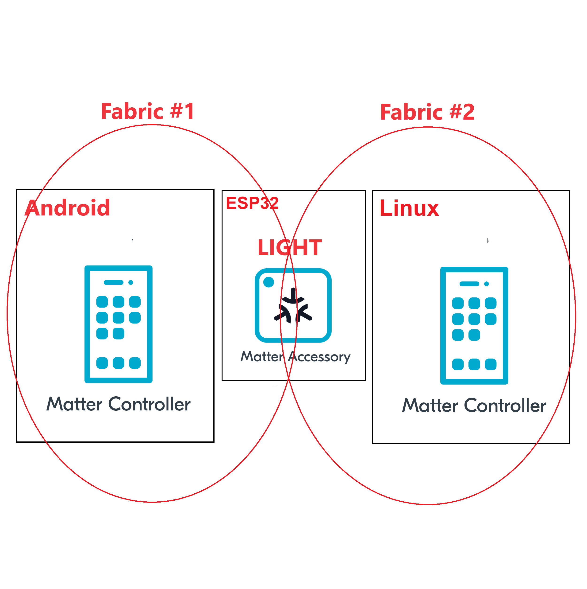

summary: How to use multi-admin
id: how-to-use-multi-admin
categories: Sample
tags: matter
status: Published 
authors: MatterCoder
Feedback Link: https://mattercoder.com

# How to use multi-admin
<!-- ------------------------ -->
## Overview 
Duration: 15

In this codelab we will show you how to use the Multi Admin feature of the Matter protocol.

### What You’ll Build 
In this codelab, you will:
- Run the Matter light you created on an ESP32
- Learn how to configure your Matter light to join wifi network at start time
- Use the chip-tool android app as a Matter controller to act as the first admin.
- Use the chip-tool on Linux as a Matter controller to act as another admin.

### Architecture


In this CodeLab we will run a Matter Latter on a ESP32 microcontroller, the Matter Controller on an Android mobile app and another Matter controller on Linux. This will allow us to create two matter fabrics and we will learn how to use the Multi-admin feature of the Matter protocol.

### What You’ll Learn 
- What you will need (Pre-requisities)
- How to pair the Matter light to the Android chip tool
- How to open a commissioning window
- How to pair the Matter light to the linux based chip tool
- How to control a light from multiple admins (i.e. multi chip tools).

<!-- ------------------------ -->
## What you will need (Pre-requisities)
Duration: 2

This set of Codelabs will use `Ubuntu 22.04` on a Amd64 based architecture.

You will need
- a ESP32 microcontroller. ESP32 DEV KIT C
- a laptop or PC running `Ubuntu 22.04` with a Bluetooth interface
- an android phone running the chip-tool
- Visual Studio Code IDE
- a basic knowledge of Linux shell commands
- the Matter light built in previous codelabs

The total codelab will take approximately a `Duration of 30 minuates` to complete. 

<!-- ------------------------ -->
## Flash the Matter Light to an ESP32 
Duration: 2

You should have built the Matter switch in a previous codelab.

1. The first thing to do is set up the ESP Matter SDK and the ESP-IDF environments (you should do this step everytime you open a new terminal)

```shell
cd esp-idf
source ./export.sh
cd ..
cd esp-matter
source ./export.sh
```

2. We will navigate to the Matter Light that you had previously coded.

```shell
cd ~/Projects/starter-esp-matter-app/
```

3. You will then flash the Matter light image on to the ESP32. But its good practice to erase the flash before hand.

```shell
idf.py -p /dev/ttyUSB0 erase_flash
idf.py -p /dev/ttyUSB0 flash monitor 
```

** replace the path with your device path

<!-- ------------------------ -->
## Commissioning the ESP32 matter light app using Android chip-tool
Duration: 2

In this section we will pair our ESP32 matter switch application on the ESP32 using the chip-tool on Android.

1. On the monitor screen for the esp32 matter light, type the following to display a link to the commissioning QR code:
```shell
matter onboardingcode qrcodeurl
```

This will display a link. Click on the link and a QR code should open on the webpage.

2. Open the Android chip tool on your Android phone.
You can build the tool yourself or download the apk from this (link) [https://github.com/nrfconnect/sdk-connectedhomeip/releases/download/v2.2.0/chip-tool-android_armv7l.apk] 

3. Select the option to "PROVISION CHIP DEVICE WITH WIFI" and then scan the qr code. Enter your WIFI details

4. Verify that you can control the light using the "LIGHT ON/OFF & LEVEL CLUSTER" option

5. Open the commissioning window to allow another matter controller to pair with the Matter light. 
Use the "MULTI-ADMIN CLUSTER" option and use the "Enhanced Commissioning Method". Take note of the pin code.

<!-- ------------------------ -->
## Commissioning the ESP32 matter light app using chip-tool
Duration: 2

In this section we will pair our ESP32 matter light application on the ESP32 using the chip-tool that acts as a matter controller. This will create a second matter fabric and will demonstrate that a Matter light can be simultaneously controlled by multiple admins.

### Verify that the commissioning window is open.

Firstly, you can verify that the Matter light has an open commissoning window by using the following command on a terminal on your linux host

```shell
avahi-browse -rt _matterc._udp
```

### Pairing with the CHIP Tool

1. Execute the following command in the connectedhomeip directory:

```shell
./out/host/chip-tool pairing code 1 34970112332
```

Replace the code above with the code you noted from the Android chip tool.


If everything is working you should see output logs and you should see that the commissioning was successful

```shell
[1683309736.149316][15:17] CHIP:CTL: Successfully finished commissioning step 'Cleanup'
[1683309736.149405][15:17] CHIP:TOO: Device commissioning completed with success
```

2. Now that we have created a secure relationship by "commissioning" the matter accessory we will now do some simple interaction with the Matter Accessory using the chip-tool as a Matter controller. We will get into further details  of the "interaction model" and "data model" of Matter in later codelabs. But for now, we will do some simple interactions.

In the same shell window, we will read the vendor-name of the Matter accessory using the following command:

```shell
./out/host/chip-tool basicinformation read vendor-name 4 0
```

In the output logs, you should see that the Vendor Name

```shell
[1682445848.220725][5128:5130] CHIP:TOO:   VendorName: TEST_VENDOR
```

3. Check the status of the Matter Light using the chip-tool. 
You should see the On attribute on the Matter light OnOff cluster change everytime time the Light switch is pressed.

```shell
./chip-tool onoff read on-off 1 0x1
```

4. Change the light on/off using the android chip tool and see and try to read the on-off value again to see that it has changed.

5. Toggle the light on/off using the linux chip tool and see and try to read the on-off value on the Andorid app to see that it has changed.

```shell
./chip-tool onoff toggle 1 1
```

6. Read the value of the Operational Credentials and notice that we are viewing Fabric Index 2. The Android chip tool has created another Fabric at FabricIndex 1.

```shell
./chip-tool operationalcredentials read fabrics 1 0
```

### Cleaning Up
You should stop the switch-app process by using Ctrl-] in the first esp32 monitor window, the light-app process by using Ctrl-] in 
the second esp32 monitor window and then run idf erase flash.

It also a great habit to clean up the temporary files after you finish testing by using this command:
```shell
rm -fr /tmp/chip_*
```
Note: removing the /tmp/chip* files can sometimes clear up unexpected behaviours.


<!-- ------------------------ -->
## Further Information
Duration: 1

Checkout the official documentation [Espressif Matter SDK documentation here: ] (https://docs.espressif.com/projects/esp-matter/en/latest/esp32/)

Also check out the Project CHIP Matter SDK repo [Project Chip - ConnectedHomeIp](https://github.com/project-chip/connectedhomeip/tree/master/docs)

